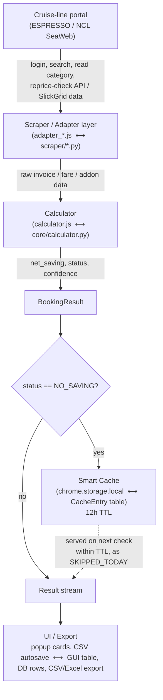

# CruiseIntel Optimization — Comprehensive Technical Documentation

**Version covered:** Extension v6.3 / Platform (Python) equivalent
**Audience:** Engineers maintaining or extending this codebase; cruise travel agency technical staff
**Scope:** Byte-level reference — every selector, constant, storage key, function signature, and business rule in this monorepo, plus engineering history and open issues.

---

## Executive Summary

CruiseIntel Optimization is an internal repricing-intelligence system built for a cruise travel agency. It automates a task travel agents otherwise do by hand: log into a cruise line's booking portal, look up a client's reservation, check whether a cheaper cabin category has become available, and figure out whether switching to it is *actually* a good deal once onboard credit (OBC) changes and lost packages/perks/fares are accounted for. The system logs into two cruise-line portals — Royal Caribbean/Celebrity's **ESPRESSO** (`cruisingpower.com`) and Norwegian Cruise Line's **SeaWeb Agents** portal (`seawebagents.ncl.com`) — reads the current price and inclusions for a booking, probes for a cheaper category, and runs a shared net-savings formula to classify the opportunity. The monorepo contains **two independent, functionally-equivalent implementations** of this same logic: a Chrome MV3 browser extension (JavaScript) for quick single-agent checks, and a Python/Playwright platform (CLI, desktop GUI, and FastAPI server) for batch processing and automation. Both implementations share the same business rules — the same net-saving formula, the same seven-way classification model, the same confidence scoring — so a booking checked by either tool produces the same verdict.

---

## Table of Contents

1. [Executive Summary](#executive-summary)
2. [Architecture Overview](#architecture-overview)
3. [Business Logic Reference](#business-logic-reference)
4. [Chrome Extension Reference](#chrome-extension-reference)
   - [manifest.json](#manifestjson)
   - [background.js](#backgroundjs)
   - [popup.js and popup.html](#popupjs-and-popuphtml)
   - [calculator.js](#calculatorjs)
   - [adapter_espresso.js](#adapter_espressojs)
   - [adapter_ncl.js](#adapter_ncljs)
5. [Python Platform Reference](#python-platform-reference)
   - [core/ — models, calculator, confidence](#core--models-calculator-confidence)
   - [scraper/ — base, espresso, ncl](#scraper--base-espresso-ncl)
   - [services/ — cache, booking orchestration, export](#services--cache-booking-orchestration-export)
   - [models/database.py — SQLAlchemy schema](#modelsdatabasepy--sqlalchemy-schema)
   - [gui/ — PySide6 desktop application](#gui--pyside6-desktop-application)
   - [main.py — CLI](#mainpy--cli)
   - [easy_menu.py — console menu](#easy_menupy--console-menu)
   - [api/ — FastAPI server](#api--fastapi-server)
   - [scheduler/jobs.py — APScheduler](#schedulerjobspy--apscheduler)
   - [config/settings.py](#configsettingspy)
   - [utils/ — logging and retry](#utils--logging-and-retry)
   - [Build, packaging, and environment](#build-packaging-and-environment)
6. [Storage & Schema Reference](#storage--schema-reference)
7. [Bug History / Lessons Learned](#bug-history--lessons-learned)
8. [Known Open Issues](#known-open-issues)
9. [Setup & Operation](#setup--operation)
10. [Roadmap](#roadmap)

---

## Architecture Overview

### Monorepo layout

```
Cruise-Price-Optimization-Extension-main/
├── extension/                  Chrome MV3 extension (JavaScript)
│   ├── manifest.json
│   ├── background.js           "Traffic Cop" — state, queue, dedicated window, retry/token logic
│   ├── popup.js / popup.html   UI layer — renders state, dispatches messages
│   ├── calculator.js           Pure business logic (net-saving formula, confidence, sentinels)
│   ├── adapter_espresso.js     ESPRESSO portal DOM/fetch automation
│   └── adapter_ncl.js          NCL SeaWeb portal DOM/JS-global automation
│
└── platform/                   Python / Playwright platform
    ├── core/                   models.py, calculator.py, confidence.py — the same business logic, in Python
    ├── scraper/                base.py, espresso.py, ncl.py — Playwright automation, ported from the adapters
    ├── services/                cache_service.py, booking_service.py, csv_export.py, excel_export.py
    ├── models/                  database.py — SQLAlchemy ORM schema (SQLite by default)
    ├── gui/                     PySide6 + qasync desktop scanner application
    ├── api/                     FastAPI REST server (designed, currently unused by the real workflow)
    ├── scheduler/                APScheduler jobs (wired up, never invoked)
    ├── config/                  settings.py — pydantic-settings configuration
    ├── utils/                   logging.py (structlog), retry.py (retry_async)
    ├── main.py                  CLI entry point (api / login / scan / watch subcommands)
    ├── easy_menu.py             Console menu wrapper around the CLI, for non-technical users
    ├── run.py                   PyInstaller entry point
    ├── requirements.txt
    ├── START.bat / START_GUI.bat
    └── README.md
```

### Why two parallel implementations exist

The Chrome extension is the lightweight, zero-install-friction tool an individual agent uses for ad-hoc, one-off checks directly in their browser, reusing whatever session cookies are already in that browser profile. The Python platform exists for everything the extension architecturally cannot do well: unattended batch/overnight runs across many bookings, a real database for historical price tracking, CSV/Excel exports with richer columns, a desktop GUI for less technical staff, and a documented (if not yet wired up) path to a multi-user API server and scheduler. Both were built against the same portals and had to solve the same problems (session/token management, WLT detection, paid-in-full detection, package/OBC loss accounting), so the Python platform is described throughout its own source as a direct "port" of the extension's logic — `core/calculator.py`'s docstring literally says "Ported from calculator.js", `scraper/espresso.py` says "Ported from adapter_espresso.js", `scraper/ncl.py` says "Ported from adapter_ncl.js", and `services/booking_service.py` says its orchestration loop "is the enterprise equivalent of background.js runBatch()".

### Shared business-logic concepts

Both implementations, independently but identically, implement:
- The **net-saving formula**: `net_saving = price_drop + obc_change - lost_pkg_value` (ESPRESSO), or `net_saving = price_drop - lost_addon_value` (NCL).
- The **seven-status classification model**: `OPTIMIZATION`, `TRAP`, `NO_SAVING`, `ERROR`, `WLT`, `PAID_IN_FULL`, `SKIPPED_TODAY`.
- The **OBC_LOSS_MIN_RATIO = 3.0** rule that downgrades a technically-positive net saving to `NO_SAVING` when the price drop doesn't clear 3× the forfeited OBC.
- The **re-addable fares heuristic** (`/email|bonus|promo|loyalty|coupon/i`).
- **1–5 star confidence scoring** from fare-change %, net-saving %, package loss, and OBC direction.
- A **smart cache** that only stores `NO_SAVING` verdicts, keyed by cruise line + booking id, with a 12-hour TTL.

### Data flow



In both implementations the flow is identical in shape: navigate the portal → search the booking → read the current category and invoice → open the categories/pricing comparison (Angular reprice-modal fetches for ESPRESSO, SlickGrid data model for NCL) → hand the raw data to the calculator → get back a classified `BookingResult` → cache it if `NO_SAVING` → surface it to the user (extension popup card / GUI table row / CLI console output / CSV & Excel export).

---

## Business Logic Reference

This section quotes the algorithm exactly as implemented in `platform/core/calculator.py` and `platform/core/confidence.py` (the JavaScript in `extension/calculator.js` is functionally identical — see [calculator.js](#calculatorjs) for the JS-specific naming).

### The seven booking statuses

Declared in `core/models.py` as `BookingStatus(str, Enum)`, in this exact order:

| Status | Meaning |
|---|---|
| `OPTIMIZATION` | A genuine savings opportunity — net saving is positive and clears all trap/ratio checks. |
| `TRAP` | A price drop that looks attractive on the surface but actually costs the client more once losses are counted. |
| `NO_SAVING` | No real opportunity — either no price drop, or the drop doesn't clear the OBC-loss ratio, or net is non-positive with no price drop. |
| `ERROR` | The check failed (portal error, timeout, unexpected response) — `error` field holds the exception message. |
| `WLT` | The target category is waitlisted — repricing is not actually possible. |
| `PAID_IN_FULL` | The booking is already paid in full — portals block repricing on paid bookings. |
| `SKIPPED_TODAY` | Served from the smart cache — this booking returned `NO_SAVING` recently and wasn't re-scraped live. |

### The net-saving formula

**ESPRESSO:**
```
price_drop  = old_total - new_total
obc_change  = new_obc - old_obc            (negative = OBC was reduced/forfeited)
net_saving  = price_drop + obc_change - lost_pkg_value
```

**NCL** (simpler — no OBC line item; only addon/OBC-certificate loss matters):
```
price_drop      = old_total - new_total
net_saving      = price_drop - lost_addon_value
```

### OBC_LOSS_MIN_RATIO rule

```python
OBC_LOSS_MIN_RATIO = 3.0
```
Comment in source, quoted exactly: *"Minimum ratio of (price drop) to (OBC lost) before a repricing that forfeits OBC is treated as a genuine optimization rather than a wash."*

This is a deliberate business decision by the project owner, added after reviewing real booking data: a $300 price drop against a $250 OBC loss (net $50) is technically net-positive, but only a ~1.2× margin — judged too risky to auto-flag as a win. The rule requires the price drop to be **at least 3.0× the OBC being forfeited**, or the result is downgraded from `OPTIMIZATION` to `NO_SAVING`.

### Full classification logic — `calculate_espresso` (exact order, quoted from `core/calculator.py`)

```python
if net > 0 and lost_pkg_value > 0 and net < lost_pkg_value:
    status = TRAP
    note = f"trap - losing ${round(lost_pkg_value)} perk for only ${round(net)} net{re_add_note}"

elif net > 0 and obc_change < 0 and price_drop < abs(obc_change) * OBC_LOSS_MIN_RATIO:
    status = NO_SAVING
    note = f"no saving — ${round(price_drop)} drop costs ${round(abs(obc_change))} OBC (need {OBC_LOSS_MIN_RATIO:.0f}x){re_add_note}"

elif net > 0:
    status = OPTIMIZATION
    note = f"optimized ${round(net)}{re_add_note}"

elif price_drop > 0 and net <= 0:
    status = TRAP
    note = f"trap - do not reprice{re_add_note}"

else:
    status = NO_SAVING
    extra = " — can re-add: " + ", ".join(re_addable_fares) if re_addable_fares else ""
    note = f"no saving{extra}"
```

Rationale comments, quoted verbatim from source:
- **TRAP (branch 1, perk trap)**: *"Net saving is positive on paper, but it's smaller than the value of a package being given up to get it — the client is trading a perk worth more than the 'win' itself. Confirmed against a real case: $50 net saving from losing a $594 all-inclusive drink package is not a real optimization."*
- **NO_SAVING (branch 2, OBC trap)**: *"Net is positive on paper, but a chunk of it is OBC being forfeited rather than a real fare reduction — confirmed against a real case: a $300 price drop that cost $250 of OBC (net $50) is only a ~1.2x margin, not a safe trade. Only worth recommending once the price drop clears the OBC being given up by OBC_LOSS_MIN_RATIO."*

Read as prose, in evaluation order:
1. **TRAP (perk trap)**: net positive AND a package was lost AND net is *less* than the value of that lost package.
2. **NO_SAVING (OBC trap)**: net positive AND OBC was reduced AND the raw price drop is less than 3× the absolute OBC lost.
3. **OPTIMIZATION**: net positive, clears both traps above.
4. **TRAP (plain)**: price nominally dropped but net is ≤ 0 (fees/OBC/package loss ate the whole drop or more) — "do not reprice".
5. **NO_SAVING (catch-all)**: everything else.

### `calculate_ncl` classification

```python
if net > 0:
    status = OPTIMIZATION
    note = f"NCL optimized ${round(net)}" + (" — verify addons: " + ", ".join(lost_addon_names) if lost_addon_names else "")
elif price_drop > 0 and net <= 0:
    status = TRAP
    note = f"NCL trap — price drop offset by addon loss: {', '.join(lost_addon_names)}"
else:
    status = NO_SAVING
    note = "NCL no saving"
```
NCL loss detection is narrower than ESPRESSO's: only addons whose name matches `On-Board Credit Certificate` / `OBC Certificate` (case-insensitive) count as losses, and only if the `FOBC` ("Free OBC") promo code itself was also lost between old and new promo strings (`lost_fobc = "FOBC" in old_promo_str and "FOBC" not in new_promo_str`). Other addon types (wifi, dining, beverage, excursion) are priced by the lookup table but never actually subtracted unless they also match the OBC-certificate regex.

### Re-addable fares heuristic

```python
_READDABLE_PATTERNS = [
    re.compile(r"email", re.IGNORECASE),
    re.compile(r"bonus", re.IGNORECASE),
    re.compile(r"promo", re.IGNORECASE),
    re.compile(r"loyalty", re.IGNORECASE),
    re.compile(r"coupon", re.IGNORECASE),
]
def _is_re_addable(fare_name: str) -> bool:
    return any(p.search(fare_name) for p in _READDABLE_PATTERNS)
```
A fare lost in the reprice whose name matches any of `email`, `bonus`, `promo`, `loyalty`, `coupon` is classified as **re-addable** (the agent can typically reapply it after the reprice) rather than **truly lost**. This split feeds three `BookingResult` fields: `lost_fares` (truly lost, not re-addable), `re_addable_fares` (lost but heuristically recoverable), and `gained_fares` (new fares present after reprice that weren't before). These three fields appear in the Excel export but — as documented under Known Open Issues — are absent from the CSV export.

### Confidence scoring — `calc_confidence` (exact algorithm, `core/confidence.py`)

```python
@dataclass
class ConfidenceResult:
    score: int          # 1-5 stars
    fare_change_pct: float
    old_cruise_fare: float
    new_cruise_fare: float

def calc_confidence(old_cruise_fare, new_cruise_fare, net_saving, old_total, lost_pkg_value, obc_change) -> ConfidenceResult:
```

1. `fare_change_pct = (new_cruise_fare - old_cruise_fare) / old_cruise_fare if old_cruise_fare > 0 else 0.0` (raw ratio, not yet ×100).
2. `net_pct = net_saving / old_total if old_total > 0 else 0.0`.
3. `pts = 0`, then additive scoring:
   - **Fare direction** (mutually exclusive `if/elif` chain):
     - `fare_change_pct < -0.02` → `pts += 2`
     - `elif fare_change_pct < 0` → `pts += 1`
     - `elif fare_change_pct > 0.15` → `pts -= 2`
     - `elif fare_change_pct > 0.05` → `pts -= 1`
     - (exactly at 0, or in `(0, 0.05]` → no adjustment)
   - **Net saving impact**:
     - `net_pct > 0.05` → `pts += 2`
     - `elif net_pct > 0.02` → `pts += 1`
   - **Package/OBC stability** (independent, not `elif`):
     - `if lost_pkg_value <= 0: pts += 1`
     - `if obc_change >= 0: pts += 1`
4. **Points → stars lookup table**:
   ```python
   pts_to_stars = {-2: 1, -1: 1, 0: 2, 1: 2, 2: 2, 3: 3, 4: 4, 5: 5, 6: 5}
   clamped = max(-2, min(6, pts))
   score = pts_to_stars.get(clamped, 3)
   ```
5. **Safety caps** (applied after the lookup, in order):
   - `if fare_change_pct >= 0.05 and score > 3: score = 3`
   - `if fare_change_pct > 0.10 and lost_pkg_value > 0: score = min(score, 2)`
6. Returns `ConfidenceResult(score=score, fare_change_pct=round(fare_change_pct * 100, 2), old_cruise_fare=old_cruise_fare, new_cruise_fare=new_cruise_fare)` — note `fare_change_pct` in the *return value* is scaled ×100 (percentage points), whereas all internal comparisons above used the raw fraction.

Entire function body is wrapped in `try/except Exception` → fallback `ConfidenceResult(score=3, fare_change_pct=0.0, old_cruise_fare=0.0, new_cruise_fare=0.0)` (default mid confidence on any error).

**NCL uses a separate, simpler confidence heuristic** (not `calc_confidence` — see `calculate_ncl`):
```python
if price_drop > 0 and lost_addon_value == 0:          confidence = 5
elif price_drop > 0 and lost_addon_value < price_drop: confidence = 4
elif price_drop > 0 and lost_addon_value >= price_drop: confidence = 2
else:                                                    confidence = 2
```

### Smart caching

Only `NO_SAVING` results are cached — the class docstring in `cache_service.py`, *"Smart cache for NO_SAVING results"*, is literal, not just descriptive. The write gate (in `booking_service.py._run_batch`):
```python
if not bypass_cache and result.status == BookingStatus.NO_SAVING:
    await self.cache.set_no_saving(job.cruise_line.value, booking_id)
```
`OPTIMIZATION`, `TRAP`, `WLT`, `PAID_IN_FULL`, `ERROR`, and `SKIPPED_TODAY` results are **never** written to cache. Cache key format: `cache_{cruise_line}_{booking_id}` (e.g. `cache_ESPRESSO_4097990`). TTL default: **12 hours** (`cache_ttl_hours: int = 12` in settings; `CACHE_TTL_MS = 12 * 60 * 60 * 1000` in the extension). A cache hit produces a `SKIPPED_TODAY` result via `make_skipped_result`/`makeSkippedResult`, carrying an `hours_ago` figure.

**Important limitation, by design, as of this writing**: the cache is purely **time-anchored**, not price-anchored. It stores only presence + expiry (`{ts: <epoch-ms>}` in the extension; `key` + `expires_at` in the platform's `CacheEntry` table) — it does not record what price it saw when it cached the `NO_SAVING` verdict. This means a booking that goes NO_SAVING today, then has an unrelated market price shift tomorrow, will still be silently skipped until the 12-hour TTL lapses. The project owner has discussed evolving this into a price-anchored cache (store the last-known price so a market move can invalidate the cache early), but **this evolution has not been implemented** — it is a documented future direction only (see [Roadmap](#roadmap)).

---

## Chrome Extension Reference

Source root: `extension/`. Files: `manifest.json`, `background.js`, `popup.js`, `popup.html`, `calculator.js`, `adapter_espresso.js`, `adapter_ncl.js`.

### manifest.json

```json
{
  "manifest_version": 3,
  "name": "CruiseIntel Optimization",
  "version": "6.3",
  "description": "Repricing intelligence for Royal Caribbean, Celebrity & Norwegian Cruise Line",
  "permissions": ["tabs", "scripting", "storage", "activeTab", "windows", "alarms"],
  "host_permissions": [
    "https://secure.cruisingpower.com/*",
    "https://seawebagents.ncl.com/*"
  ],
  "action": {
    "default_popup": "popup.html",
    "default_title": "CruiseIntel Optimization",
    "default_icon": { "48": "icon.png" }
  },
  "background": { "service_worker": "background.js" },
  "icons": { "48": "icon.png" }
}
```

- **manifest_version**: 3. **name**: `CruiseIntel Optimization`. **version**: `6.3`.
- **permissions** (exact array): `tabs`, `scripting`, `storage`, `activeTab`, `windows`, `alarms`.
- **host_permissions** (exact array): `https://secure.cruisingpower.com/*`, `https://seawebagents.ncl.com/*`.
- **action**: popup = `popup.html`, title = `CruiseIntel Optimization`, icon 48px only (no 16/32/128).
- **background**: non-persistent MV3 service worker, `background.js`. No `"type": "module"` — classic script, hence `importScripts` is used, not ES `import`.
- **icons**: only `48: icon.png` at top level.
- **No** `content_scripts`, **no** `content_security_policy` key (defaults apply), **no** `web_accessible_resources`, **no** `optional_permissions`, **no** `externally_connectable`.

### background.js

Header comment: `// background.js — CruiseIntel Optimization v6.3` / `// Traffic Cop: routes bookings, manages queue, owns the dedicated window.`

`importScripts('calculator.js', 'adapter_espresso.js', 'adapter_ncl.js');` — this is how the three other JS files' functions/globals become available inside the single service-worker execution context (classic worker script, not a module).

#### Module-level state

```js
let state = {
  running: false,
  results: [],
  log: [],
  progress: { done: 0, total: 0, currentId: null },
  cruiseLine: 'ESPRESSO'
};
let dedicatedWinId = null;
let dedicatedTabId = null;
const CACHE_TTL_MS = 12 * 60 * 60 * 1000;   // 12 hours

const BG_NCL_SEARCH_URL = 'https://seawebagents.ncl.com/tva/search/';
const BG_ESPRESSO_URL   = 'https://secure.cruisingpower.com/espresso/protected/reservations.do';
```

#### Keep-alive alarm

```js
chrome.alarms.create('keepAlive', { periodInMinutes: 0.4 });   // 24 seconds
chrome.alarms.onAlarm.addListener(alarm => {
  if (alarm.name === 'keepAlive') chrome.runtime.getPlatformInfo(() => { });
});
```
MV3 service workers are killed after ~30s idle / 5 min max lifetime; a 24-second repeating alarm firing a no-op call resets the idle timer so the worker survives long batch runs.

#### `_bgLog(bookingId, step, status, detail)`
Builds entry `{ time: new Date().toLocaleTimeString('en-GB', { hour12: false }), bookingId: bookingId || '—', step, status, detail: typeof detail === 'object' ? JSON.stringify(detail) : String(detail || '') }`; pushes to `state.log`; ring-buffer capped at **600 entries** (`if (state.log.length > 600) state.log.shift()`); calls `broadcastState()`. Time format `en-GB`, 24-hour → `HH:MM:SS`.

#### `broadcastState()`
`chrome.runtime.sendMessage({ action: 'stateUpdate', ...getPublicState() }).catch(() => {})` — fire-and-forget broadcast; swallows "no receiver" error when popup is closed.

#### `getPublicState()`
Returns `{ running, results, log, progress, cruiseLine }` (excludes internal window/tab ids).

#### Utilities
- **`sleep(ms)`**: `return new Promise(r => setTimeout(r, ms));`
- **`retry(fn, attempts = 3, delayMs = 3000, label = '')`**: loops `i` 0..attempts-1; `await fn(i)`; on throw, if last attempt re-throws, else logs `_bgLog('RETRY', label, 'WARN', 'Attempt ${i+1}/${attempts} failed: ${e.message}')` and `await sleep(delayMs)`. **Default: 3 attempts, 3000ms delay.**
- **`runInPage(tabId, fn, ...args)`**: `chrome.scripting.executeScript({ target: { tabId }, func: fn, args, world: 'MAIN' })` — runs in page's **MAIN** world so it can see page globals (`window.__preloaded_data`, `window.VX`).
- **`navigateTo(tabId, url)`**: wraps `chrome.tabs.update`; listens for `changeInfo.status === 'complete'`; 300ms settle buffer on success; **30,000ms hard timeout**, resolving anyway if hit.
- **`waitForEl(tabId, selector, timeout = 10000)`**: polls every **400ms**; throws `Error('Timeout (${timeout}ms) for: ${selector}')` on deadline.

#### Dedicated (batch) window management
- **`ensureDedicatedWindow()`**: reuses existing minimized window if alive; else creates `chrome.windows.create({ url: 'about:blank', state: 'minimized', type: 'normal' })`.
- **`getDedicatedTab()`**: heals a closed tab by resetting ids and re-running `ensureDedicatedWindow()`.
- **`closeDedicatedWindow()`**: removes the window, resets ids.

The dedicated window is created **minimized** so batch automation runs invisibly while the user can still use their own browser windows.

#### Smart cache (NO_SAVING result caching)
- **`getCachedResult(cruiseLine, bookingId)`**: key = `` `cache_${cruiseLine}_${bookingId}` ``. Returns `null` if absent or expired (removes expired key). Else returns `{ ts: <number> }`.
- **`cacheNoSaving(cruiseLine, bookingId)`**: writes `{ [key]: { ts: Date.now() } }`.
- Storage key pattern: `cache_ESPRESSO_<bookingId>` / `cache_NCL_<bookingId>` → `{ ts: <epoch ms> }`. TTL 12 hours.

#### AutoSave CSV — `autoSaveCSV()`
No-op if `!state.results.length`. Header (exact): `Booking ID,Cruise Line,Status,Net Saving,Old Total,New Total,Category,New Category,Note,Lost Packages`. Field order per row:
1. `d.bookingId` 2. `d.cruiseLine || state.cruiseLine` 3. `r.status` 4. `d.netSaving?.toFixed(2) || 0` 5. `d.oldTotal?.toFixed(2) || 0` 6. `d.newTotal?.toFixed(2) || 0` 7. `d.priceCategory || ''` 8. `d.newPriceCategory || ''` 9. `d.note || ''` 10. `(d.lostPkgNames || []).join('|')`.

Escaping: `e = v => '"' + String(v||'').replace(/"/g,'""') + '"'` (always double-quoted). Persisted to `chrome.storage.local` as **`autoSaveCSV`** (full CSV text) and **`autoSaveTime`** (ISO timestamp). Called after every single booking completes (including cached-skip path).

#### `handleESPRESSOBooking(bookingId)`
Wrapped in `retry(..., 3, 3000, 'ESPRESSO ${bookingId}')`. Per attempt:
1. If retry attempt >0, log re-navigating.
2. Navigate `BG_ESPRESSO_URL`.
3. `espresso_waitForLogin(tabId, bookingId)` — throws if not logged in.
4. `fn_espresso_search(bookingId)` — throws on failure.
5. `waitForEl(tabId, '#sideBar, [id*="sideBar"]', 15000)`.
6. `fn_espresso_readCategory()` → stores `priceCategory` (persists across retries).
7. `fn_espresso_clickCategories()` — throws if link not found.
8. `waitForEl(tabId, '#catAvailCategoryList, [id*="catAvail"]', 12000)`.
9. **WLT check** (must run after categories table loaded): if `priceCategory` truthy, `fn_espresso_checkWLT(priceCategory)`; if WLT, returns `{ _wlt: true }` (short-circuits retry, not an exception).
10. `fn_espresso_readPageData(priceCategory)` — throws `'No execution token in URL'` if missing.
11. `fn_espresso_executeAPICalls(...)` — throws on `!r?.ok`.
12. **Short-response branch** (`(r.dataLength || 0) < 300`): checks paid status first (→ `{ _paidInFull: true, oldTotal }`); else reads top-of-page displayed prices and, if current == allocation price (within `0.01`), returns `{ _noPriceChange: true, price }`; else throws `'API returned only ${r.dataLength} chars — token likely expired'` (triggers retry). **Code comment explicitly documents the fix history**: an earlier version checked price *before* the allocate/reprice calls ran and produced false "no change" verdicts because the page hadn't updated yet — masking real optimizations. The check now runs only after the real API calls, using the displayed price purely as confirmation.
13. Else: full API result returned.

After `retry(...)` resolves: dispatches on `_wlt` / `_paidInFull` / `_noPriceChange` sentinels, else calls `calculateESPRESSO(apiResult.data, bookingId, priceCategory)`; caches if `NO_SAVING`.

#### `runBatch(bookings, cruiseLine = 'ESPRESSO')`
1. Resets `state.running/cruiseLine/progress/results`.
2. `ensureDedicatedWindow()`.
3. For each booking (loop breaks early if `!state.running`):
   - **Cache check** first — on hit, pushes `SKIPPED_TODAY` result, `sleep(10)`, `continue`.
   - Else `getDedicatedTab()`, dispatches to `handleNCLBooking`/`handleESPRESSOBooking`, catches errors → `makeErrorResult`.
   - Pushes result, `autoSaveCSV()`, `broadcastState()`, `sleep(500)` (pacing between bookings).
4. After loop: `closeDedicatedWindow()`, `state.running=false`.

#### `handleOptimize(bookingId, cruiseLine, targetCategory)`
Always spawns a **fresh, visible, isolated window** (`chrome.windows.create({ state:'normal', width:1200, height:800 })`) — explicit fix for a prior bug where `getDedicatedTab()` could crash a running batch. NCL branch: search → wait for summary → optionally switch to edit mode and select the target category (leaving the STORE click to the human). ESPRESSO branch: search → read category → click Categories → read page data → `fn_espresso_allocateOnly` (allocate POST only, no reprice-check) → `sleep(500)` → `fn_espresso_clickContinue()` → `sleep(1500)` — opens the native reprice popup for human review. Brings the window forward via `chrome.windows.update(..., { focused: true })`. Never re-throws/returns anything — the popup's button is re-enabled purely by a client-side 12s `setTimeout`, not an actual completion signal.

#### Message handler (`chrome.runtime.onMessage`)

| `msg.action` | Behavior | Response |
|---|---|---|
| `getState` | read-only | `getPublicState()` |
| `startBatch` | refuses if already running; else `runBatch(bookings, cruiseLine)` (fire-and-forget) | `{ok:false,error:'Already running'}` or `{ok:true}` |
| `stopBatch` | `state.running=false; broadcastState()` | `{ok:true}` |
| `clearState` | resets state; removes only `autoSaveCSV`/`autoSaveTime` (preserves `cache_*` keys) | `{ok:true}` |
| `setCruiseLine` | `state.cruiseLine = msg.cruiseLine` | `{ok:true}` |
| `optimizeBooking` | `handleOptimize(...)` (fire-and-forget) | `{ok:true}` |
| `viewInPortal` | opens a fresh window at the portal's search/reservation URL | `{ok:true}` |
| `getAutoSaveCSV` | reads `chrome.storage.local` | `{autoSaveCSV, autoSaveTime}` |

All handlers `return true` (async `sendResponse`) even for synchronous fires.

### chrome.storage keys (complete inventory)

| Key | Area | Shape | Written by | Read by |
|---|---|---|---|---|
| `cache_<cruiseLine>_<bookingId>` | `local` | `{ ts: <epoch-ms> }` | `cacheNoSaving()` | `getCachedResult()` |
| `autoSaveCSV` | `local` | full CSV text | `autoSaveCSV()` | `getAutoSaveCSV` handler → popup export |
| `autoSaveTime` | `local` | ISO timestamp string | `autoSaveCSV()` | returned alongside `autoSaveCSV` |
| `bookingInput` | `session` | raw textarea contents | popup.js input listener | popup.js on load, restores textarea |

`clearState` removes only `autoSaveCSV`/`autoSaveTime`, explicitly preserving all `cache_*` keys.

### Runtime messages

**popup.js → background.js**: `getState`, `startBatch {bookings, cruiseLine}`, `stopBatch`, `clearState`, `setCruiseLine {cruiseLine}`, `optimizeBooking {bookingId, cruiseLine, targetCategory}`, `viewInPortal {bookingId, cruiseLine}`, `getAutoSaveCSV`.

**background.js → popup.js**: `stateUpdate {running, results, log, progress, cruiseLine}` (broadcast).

No other message types exist; adapters communicate with background.js via direct function call (shared worker global scope via `importScripts`), not messaging.

### popup.js and popup.html

#### Key functions

- **`parseBookings(raw)`**: `raw.split(/[\n,]+/).map(s => s.trim().replace(/\D/g,'')).filter(s => s.length>=5 && s.length<=12)`.
- **`setStatus(msg, color)`** / **`setProgress(done, total, running)`** — straightforward DOM text/class updates.
- **`addCard(bookingId, status, data)`**: badge map:
  ```
  { OPTIMIZATION:'✅ Optimization', TRAP:'⚠️ Trap', NO_SAVING:'⭐ No saving',
    ERROR:'❌ Error', WLT:'⭐ WLT', CHECKING:'Checking',
    PAID_IN_FULL:'💳 Paid in Full', SKIPPED_TODAY:'⏩ Cached' }
  ```
  `CHECKING` renders a minimal spinner card and returns early. Confidence stars only render when `data?.confidence` truthy AND `status==='OPTIMIZATION'`: `stars = '★'.repeat(sc) + '☆'.repeat(5-sc)`, colors `{1:'#ef4444',2:'#f59e0b',3:'#3b82f6',4:'#10b981',5:'#059669'}`. `OPTIMIZATION` cards insert at the **top** of the list; all others append at the bottom.
- **`updateSummary(res)`**: counts by status bucket; `#sSaved` sums `netSaving` over `OPTIMIZATION` only.
- **`renderLog()`**: colorized log lines, auto-scrolls to bottom.
- **`applyState(s)`**: the state-sync entry point — disables cruise-line/clear controls while running, renders cards/summary/progress, live-updates the log panel if visible.
- **`updateCruiseLineUI(cl)`**: toggles ESPRESSO/NCL active styling, header subtitle, hint text.
- **`DOMContentLoaded`** wiring: restores `bookingInput` from `chrome.storage.session`; wires cruise-line toggle, run/stop/clear/log/export buttons, and event-delegated `.copy-btn`/`.optimize-btn`/`.view-btn` clicks inside `#results`.

CSV export is client-side trivial: popup.js just requests the already-built `autoSaveCSV` string and downloads it as `cruiseintel_<ISO-date>.csv` (client-side current date at export time, not `autoSaveTime`).

#### popup.html structure

Fixed **420px wide** popup, font `-apple-system, BlinkMacSystemFont, Arial, sans-serif`, 13px, bg `#f8fafc`. Notable CSS classes: `.header` (gradient `linear-gradient(135deg,#1e3a5f,#1d4ed8)`), `.cl-btn.active.espresso` (blue `#1d4ed8`) / `.cl-btn.active.ncl` (red `#d4002a`), `.card.OPTIMIZATION` (green left border `#10b981`), `.card.TRAP` (amber `#f59e0b`), `.card.ERROR` (red `#ef4444`), `.card.PAID_IN_FULL` (purple `#8b5cf6`), `.conf-row`/`.conf-stars` (confidence pill), `.card-pkg-loss` (orange lost-package warning), `#logPanel` (dark terminal-style, monospace, max-height 150px). Textarea placeholder (literal): `4097990` + newline + `64756965, 60129622`.

### calculator.js

#### Helpers
`safeFloat(v)` → `parseFloat`, NaN→0. `round2(x)` → `Math.round(safeFloat(x)*100)/100`. `normStr(s)` → `(s||'').trim().toUpperCase()`.

#### ESPRESSO fee classification
```js
const ESPRESSO_FEE_TYPES = new Set([
  'VACATION_TOTAL','OBC_TOTAL','PORT_CHARGE','PORT_EXPENSES',
  'GOVERNMENT_TAX','TAXES_AND_FEES','NCF','NCCF','CRUISE','CRUISEFARE',
  'GRATUITIES','TAX','FEE'
]);
```
`espressoIsFee(item)`: true if `normStr(item.type)` in the set above; OR name matches `/^(NCCF|NCF|PORT|TAX|FEE|GOVERNMENT|GRATUIT)/`; OR name includes `' OBC'` / ends with `'OBC'` / starts with `'OBC '`.
`espressoGetTotal(items, type)`: first `paxId==='total' && type match` item's amount, else 0.
`espressoGetCruiseFare(items)`: first `paxId==='total'` item whose raw `type` ∈ `['CRUISE','CRUISEFARE','cruise']`; fallback — largest-amount `paxId==='total'` item not in the `SKIP` set (`VACATION_TOTAL, OBC_TOTAL, TAXES_AND_FEES, PORT_CHARGE, PORT_EXPENSES, GOVERNMENT_TAX, NCF, NCCF`).
`espressoGetPackages(items)`: `paxId==='total' && amount>0 && !espressoIsFee(item)`.

#### NCL addon value table
```js
const NCL_ADDON_VALUES = {
  'wi-fi':150, 'wifi':150, 'internet':150,
  'dining':80, 'specialty dining':80, 'restaurant':80,
  'beverage':200, 'bar':200, 'drink':200, 'open bar':200,
  'excursion':50, 'shore':50,
};
```
`nclAddonValue(addonName)`: lowercases; if it contains a literal `$NNN` (regex `/\$(\d+)/`), uses that; else first substring match in the table; else 0.

#### Re-addable fares
```js
const READDABLE_PATTERNS = [/email/i, /bonus/i, /promo/i, /loyalty/i, /coupon/i];
function isReAddable(fareName) { return READDABLE_PATTERNS.some(p => p.test(fareName)); }
```

#### `OBC_LOSS_MIN_RATIO = 3`
Same comment as the Python port: *"Minimum ratio of (price drop) to (OBC lost) before a repricing that forfeits OBC is treated as a genuine optimization rather than a wash."*

#### `calcConfidence(oldItems, newItems, net, oldTotal, lostPkgValue, obcChange)`
Identical algorithm to Python's `calc_confidence` (see [Business Logic Reference](#business-logic-reference)): points table `{'-2':1,'-1':1,'0':2,'1':2,'2':2,'3':3,'4':4,'5':5,'6':5}`, safety caps `fareChangePct >= 0.05 && score > 3 → 3`, `fareChangePct > 0.10 && lostPkgValue > 0 → min(score, 2)`. On exception, returns `{score:3, fareChangePct:0, oldCruise:0, newCruise:0}`.

#### `calculateESPRESSO(raw, bookingId, priceCategory)`
`data = raw.result || raw`. Computes `oldTotal`/`newTotal` from `VACATION_TOTAL`, `oldOBC`/`newOBC` from `OBC_TOTAL`, `priceDrop = round2(oldTotal-newTotal)`, `obcChange = round2(newOBC-oldOBC)`. Package-loss diffing via `espressoGetPackages` old-vs-new sets. **`net = round2(priceDrop + obcChange - lostPkgValue)`** — the core formula. Fare diffing produces `reAddableFares`/`trulyLostFares`/`gainedFares`. Classification logic identical to the Python version quoted in [Business Logic Reference](#business-logic-reference) (same 5-branch order). Returns:
```js
{
  cruiseLine:'ESPRESSO', status, note, bookingId, priceCategory, oldTotal, newTotal, priceDrop, obcChange,
  lostPkgValue, lostPkgNames, netSaving: net, lostFares: trulyLostFares, reAddableFares, gainedFares,
  confidence: conf.score, oldCruiseFare: conf.oldCruise, newCruiseFare: conf.newCruise,
  fareChangePct: conf.fareChangePct, error: null
}
```
On exception: `{ cruiseLine:'ESPRESSO', status:'ERROR', error:e.message, bookingId, priceCategory }`.

#### `calculateNCL(bookingId, priceCategory, invoiceTotal, newResTotal, addons, oldPromos, newPromos)`
`lostFOBC = oldPromoStr.includes('FOBC') && !newPromoStr.includes('FOBC')`. Addon loop de-dupes by name; `isOBCCert = /On-Board Credit Certificate/i.test(name) || /OBC Certificate/i.test(name)`; only counts loss if `isOBCCert && lostFOBC`. **`net = round2(priceDrop - lostAddonValue)`**. Confidence: simple 4-branch heuristic (5/4/2/2), not shared with ESPRESSO's `calcConfidence`.

#### Sentinel-result factories
`makeWLTResult`, `makePaidInFullResult`, `makeNoPriceChangeResult` (confirmed via displayed price rather than the reprice-modal API, which returns a short/non-JSON body in exactly this scenario), `makeSkippedResult`, `makeErrorResult` — each returns a fully-shaped result object with zeroed numeric fields and the appropriate `status`/`note`.

**Complete status vocabulary**: `OPTIMIZATION`, `TRAP`, `NO_SAVING`, `WLT`, `PAID_IN_FULL`, `SKIPPED_TODAY`, `ERROR`, plus the transient UI-only `CHECKING` (only in popup.js, never produced by calculator.js).

### adapter_espresso.js

#### `espresso_waitForLogin(tabId, bookingId)` (async)
Polls up to **25000ms**, checking `chrome.tabs.get(tabId).url` every **600ms**. URL contains `cruisingpower.com` and not `login`/`signin` → `{ok:true}`. Contains `login`/`signin` → `{ok:false, error:'Not logged in — please log into ESPRESSO first'}`. Timeout → `{ok:false, error:'Login check timed out'}`.

#### `fn_espresso_checkPaidStatus()` (injected)
Cascading strategies: (1) numeric `totalPrice`/`paymentsReceived` element comparison; (2) `#finalPaymentDue` equal to 0; (3) full-body regex `/paid\s+in\s+full/i`; (4) table-row scan for `'total price'`/`'payments received'` labels; (5) fallback `{isPaid:false}`.

#### `fn_espresso_search(bookingId)` (injected)
Clears and re-fills `#reservationid`, dispatches `input`/`change` events (mimics real typing for Angular bindings), clicks `#searchReservationBtn`.

#### `fn_espresso_readCategory()` (injected)
Primary: hidden field `#currentPriceCat`. Fallback selectors, in order: `#groupInfoBlock > section.category.borderRight > div.priceCategory > span.value.ng-binding`, `[class*="priceCategory"] [class*="value"]`, `.priceCategory .value`.

#### `fn_espresso_clickCategories()` (injected)
Finds `<a>` with exact text `'Categories'`, or `#sideBar a[href*="catAvail"]`, or `a[href*="categor"]`.

#### `fn_espresso_checkWLT(cat)` (injected)
Reads `#catAvailCategoryList tbody` (or `[id*="catAvail"] tbody`); matches row via `td.c1 div.categoryIcon span, .categoryIcon span` text === `cat`; reads `td.c2.rooms .svCabin .status, .svCabin .status`; `isWLT: st === 'WLT'`.

#### `fn_espresso_readTopPrices()` (injected)
Reads two `a.viewPriceQuoteLink.fit` elements, disambiguated by `ng-show` attribute substring: `sb.summary.price.price` (current) vs `sb.summary.price.allocationPrice` (selected-category). This is the authoritative, cheap "did price actually change" check — cheaper and more trustworthy than the reprice-modal fetch, which returns a non-JSON body precisely when nothing changed (the root cause of the earlier "expired token" misdiagnosis — see [Bug History](#bug-history--lessons-learned) item 4).

#### `fn_espresso_readPageData(cat)` (injected, async)
Parses execution token from URL (`/execution=(e\d+s\d+)/`). Finds the matching category row, sets the radio, dispatches `mousedown`/`mouseup`/`click()`/`change`/`input` events (thorough sequence to trigger every Angular/jQuery listener style). Polls up to **2000ms** (every **100ms**) for `selectionJSON` to change and not equal `'[]'`, plus a fixed **150ms** settle delay. Returns `{executionToken, selectionJSON, radioValue}`.

#### `fn_espresso_executeAPICalls(token, json, radio)` (injected, async) — the core reprice check

**Call 1 — Allocate**: `POST /espresso/protected/reservations.do?execution=<token>&_eventId=allocate&ajaxSource=true`, body `columnSelection=on&rbCategorySelection=<radio>&_eventId=saveCategories&categorySingleViewFormModel.selectionJSON=<json>`, headers `Content-Type: application/x-www-form-urlencoded; charset=UTF-8`, `X-Requested-With: XMLHttpRequest`, `credentials:'include'`. Then a fixed **300ms** sleep.

**Call 2 — Reprice check**: `POST /espresso/protected/repriceModalController.do/showRepriceModalCheck?execution=<token>`, body literal `execution=<token>`, headers `Content-Type: application/x-www-form-urlencoded`, `X-Requested-With: XMLHttpRequest`, `Accept: application/json, text/javascript, */*`. Response text is `JSON.parse`d; parse failure → `{ok:false, error:'Not JSON: ...'}`. Success → `{ok:true, data, dataLength: text.length, allocText}`.

Response fields referenced downstream: `result` envelope (optional) containing `oldInvoice.invoiceItems`, `newInvoice.invoiceItems`, `oldFares`/`newFares` (arrays of `{name}`). Invoice items have `paxId`, `type`, `name`/`normalizedName`, `amount`.

#### `fn_espresso_allocateOnly(token, json, radio)` (injected, async)
Same allocate POST as above, but no reprice-check call — used only by the manual "Optimize" flow, not the batch checker.

#### `fn_espresso_clickContinue()` (injected)
`#submitToContinue` or first `a,button` with exact text `'Continue'`; dispatches a synthetic `MouseEvent('click', {bubbles:true, cancelable:true, view:window})`.

#### SAFETY BOUNDARY

**This scraper/adapter must never interact with `#repriceModalAcceptBtn1` / `#repriceModalAcceptBtn2` ("Continue with New Rate") or any other control that commits a new rate to a live booking.** That is the actual save action, confirmed directly from the portal's own markup. Everything the adapter does — including the direct `showRepriceModalCheck` fetch — stops at reading the Rate Comparison data (old/new invoice, OBC, offers). The equivalent of clicking "Continue" on the categories page is simulated read-only via the allocate fetch; the equivalent of clicking "Continue with New Rate" must never be added. That step is reserved for a human, in the real portal, permanently. (Quoted from `scraper/espresso.py`'s header docstring, which states this invariant explicitly as "DO NOT CHANGE".)

### adapter_ncl.js

Header warning, quoted:
```
// ⚠️  THE 30-MINUTE LOCK — MUST READ
// When the bot clicks "Switch to Edit Mode", NCL locks the booking for 30 min.
// The finally block ALWAYS calls fn_ncl_cancelEdit to release it, even on error.
```
`const NCL_SEARCH_URL = 'https://seawebagents.ncl.com/tva/search/';`

#### Key injected functions
- **`fn_ncl_search(bookingId)`**: fills `#SWXMLForm_SearchReservation_ResID`; primary submit via `#lookup-button`; fallbacks: form's `[type="submit"]`, `form.submit()`, or any button/input whose text includes `'go'`/`'search'`.
- **`fn_ncl_checkSearchErrors()`**: checks `.error, .alert, #pageMessages, .swmessage, [class*="error"], [class*="alert"], .field-error`.
- **`fn_ncl_readPreloadedData()`**: reads `window.__preloaded_data`, extracting `resId`, `isPaid`, `isLocked`, `isEditMode`, `category`, `invoiceTotal`, `grossDue`, `netDue`, `shipCode`, `ship`, `promos`, `currentPromos` (DOM-scraped from `.item.current`'s `'Curr. Promos'` row), `guestCount`.
- **`fn_ncl_switchToEditMode()`**: clicks `#res-switch-edit`; missing → `{ok:false, notFound:true}` (tolerated as "already in edit mode").
- **`fn_ncl_checkEditMode()`**: `isEdit = !!(#res-edit-save && #res-edit-cancel)`.
- **`fn_ncl_cancelEdit()`** — **mandatory unlock**, cascading fallbacks: (1) `#res-edit-cancel` click; (2) `<a|button>` with exact uppercase text `'CANCEL EDIT'`; (3) `a[href*="viewMode"]`; (4) programmatic navigate by rewriting the URL path `/edit/` → `/view/` + `doform/viewMode?`; (5) failure `{ok:false, error:'No cancel edit mechanism found'}`.
- **`fn_ncl_scrapeAddons()`**: primary table `#transformation > div > div > div:nth-child(3) > div.content.clearfix > table`; fallback any table whose `th` includes `'Addon Name'`/`'Addon'`. Non-fatal empty result if not found.
- **`fn_ncl_clickCategoryTab()`**: `<a>` with `href` including `/agent-edit-category/` and exact text `'Category'`; fallback `a[href*="agent-edit-category"]`.
- **`fn_ncl_readCategoryData()`**: reads `window.VX?.get('_form_12')` (the SlickGrid backing data array — full dataset independent of DOM virtualization) and `window.VX?.get('_form_10')?.value?.[0]` (current category). Code comment: *"This is the key insight: the entire category dataset lives in a JS object. No DOM scraping needed. The virtualized table is irrelevant."*
- **`fn_ncl_selectCategory(targetCategory)`** (async): finds category in the `VX` data model, verifies `HasAvailability`, best-effort SlickGrid scroll (`grid.scrollRowIntoView`), then finds the matching `.slick-row` in `.slick-viewport` and clicks its `a[data-link-action="select"], a.navlink`.
- **`fn_ncl_readNewResTotalFromGrid(newCategory)`**: re-reads `resTotal`/`currentPromo` from the `VX` data model for the newly-selected category.

#### `handleNCLBooking(bookingId, tabId)` — master state machine

Step order: navigate search URL → search → wait for booking-summary selectors (20s, else check portal error text) → read `__preloaded_data` (**paid-in-full short-circuits here, before edit mode is ever entered**) → scrape addons (before edit mode, deliberately) → **enter edit mode (locks booking 30 min)** → click Category tab → wait `.slick-viewport`, `sleep(600)` → read full category array from `VX._form_12` → **filter cheaper/available/status-OK categories, sort descending by `resTotal`, pick first** (comment: *"highest-cheaper first = smallest drop"* — i.e. picks the smallest price drop among all cheaper options, not the absolute cheapest) → select via SlickGrid → `sleep(800)` → re-read confirmed new total → `calculateNCL(...)` → **finally: always attempt `fn_ncl_cancelEdit()` if `inEditMode`**, regardless of success, early return, or thrown exception.

If no cheaper category exists, the function still returns from inside the `try` (not before it), so the `finally` unlock still runs.

---

## Python Platform Reference

Source root: `platform/`.

### core/ — models, calculator, confidence

#### `core/models.py`

**`CruiseLine(str, Enum)`**: `ESPRESSO`, `NCL`.

**`BookingStatus(str, Enum)`** — exactly 7 members, in declared order: `OPTIMIZATION`, `TRAP`, `NO_SAVING`, `ERROR`, `WLT`, `PAID_IN_FULL`, `SKIPPED_TODAY`.

**`ScanJobStatus(str, Enum)`**: `PENDING`, `RUNNING`, `COMPLETED`, `FAILED`, `STOPPED`.

**`BookingResult(BaseModel)`** fields:

| Field | Type | Default | Meaning |
|---|---|---|---|
| `cruise_line` | `CruiseLine` | required | Which portal produced this result |
| `status` | `BookingStatus` | required | Classification outcome |
| `note` | `str` | `""` | Human-readable summary |
| `error` | `Optional[str]` | `None` | Exception message when `status == ERROR` |
| `booking_id` | `str` | required | Reservation ID |
| `price_category` | `Optional[str]` | `None` | Current price category at time of check |
| `new_price_category` | `Optional[str]` | `None` | Category found/selected as cheaper |
| `old_total` | `float` | `0.0` | Invoice total before reprice |
| `new_total` | `float` | `0.0` | Invoice total after hypothetical reprice |
| `price_drop` | `float` | `0.0` | `old_total - new_total` |
| `obc_change` | `float` | `0.0` | Change in OBC, new minus old (ESPRESSO only; always `0.0` for NCL) |
| `net_saving` | `float` | `0.0` | Final net figure |
| `lost_pkg_value` | `float` | `0.0` | Dollar value of forfeited packages/addons |
| `lost_pkg_names` | `list[str]` | `[]` | Names of lost packages/addons |
| `lost_fares` | `list[str]` | `[]` | Fares lost and NOT re-addable (ESPRESSO) |
| `re_addable_fares` | `list[str]` | `[]` | Fares lost but heuristically re-addable |
| `gained_fares` | `list[str]` | `[]` | New fares present after reprice |
| `confidence` | `int` | `0` | 1–5 star score |
| `old_cruise_fare` / `new_cruise_fare` | `float` | `0.0` | Cruise-fare-only line item |
| `fare_change_pct` | `float` | `0.0` | `(new-old)/old * 100`, 2dp |
| `checked_at` | `datetime` | `utcnow()` | Timestamp of analysis |

**`ScanJob(BaseModel)`**: `job_id`, `booking_ids: list[str]`, `cruise_line`, `status = PENDING`, `results: list[BookingResult] = []`, `progress_done = 0`, `progress_total = 0`, `current_booking_id`, `started_at`, `completed_at`. `model_config = {"from_attributes": True}`.

`core/__init__.py` re-exports 15 names total: the 5 model/enum names, 8 calculator functions (`calculate_espresso`, `calculate_ncl`, `make_error_result`, `make_no_price_change_result`, `make_paid_in_full_result`, `make_skip_reprice_result`, `make_skipped_result`, `make_wlt_result`), and `calc_confidence`.

#### `core/calculator.py`

Docstring: *"Price comparison and optimization engine. Ported from calculator.js — the core business logic of the system."*

Utility functions: `safe_float(value)` (NaN-safe via `result != result` self-inequality trick), `round2(x)` (`round(safe_float(x) * 100) / 100` — plain `round()`, not `Decimal`), `norm_str(s)`.

`ESPRESSO_FEE_TYPES`, `_FEE_NAME_PREFIX_RE`, `OBC_LOSS_MIN_RATIO = 3.0` — all quoted in [Business Logic Reference](#business-logic-reference).

`_is_espresso_fee`, `_get_total`, `_get_cruise_fare` (two-pass: direct type match, then largest-amount fallback among non-skip totals), `_get_packages` — Python equivalents of the JS functions of the same name, byte-for-byte identical logic.

`_READDABLE_PATTERNS`, `_is_re_addable` — see [Business Logic Reference](#business-logic-reference).

`calculate_espresso(raw_data, booking_id, price_category=None) -> BookingResult` — full body wrapped in `try/except Exception as e` → `BookingResult(status=ERROR, error=str(e), ...)`. See [Business Logic Reference](#business-logic-reference) for the exact classification branches and rationale comments.

`NCL_ADDON_VALUES`, `_DOLLAR_PATTERN`, `_ncl_addon_value` — Python port of the JS addon-value table.

`calculate_ncl(booking_id, price_category, invoice_total, new_res_total, addons=None, old_promos="", new_promos="") -> BookingResult` — see [Business Logic Reference](#business-logic-reference).

**Sentinel constructors:**
- `make_wlt_result` → `status=WLT`, `note="WLT - waitlisted"`.
- `make_paid_in_full_result(..., old_total=0)` → `status=PAID_IN_FULL`, `note="💳 Fully paid — repricing unavailable"`.
- `make_no_price_change_result(..., price=0)` → `status=NO_SAVING`, `note=f"no saving — price unchanged (${price:,.2f})"`. Docstring, quoted: *"The category's price-quote total exactly matches the current price — confirmed via the page's own displayed price (sb.summary.price.price vs sb.summary.price.allocationPrice), not the reprice-modal API, which returns a short, non-JSON body in exactly this scenario and was previously misdiagnosed downstream as an expired token."*
- `make_skip_reprice_result` → `status=NO_SAVING`, `note="Booking restriction — price program change not allowed"`. Docstring: *"ESPRESSO's API explicitly returned skipRepriceModal — a deliberate 'this booking has a restriction that blocks repricing' response, not an error... No point retrying."*
- `make_skipped_result(..., hours_ago)` → `status=SKIPPED_TODAY`, `note=f"Checked {round(hours_ago,1)}h ago — no saving cached"`.
- `make_error_result` → `status=ERROR`, `note=error_msg`, `error=error_msg`.

#### `core/confidence.py`

`ConfidenceResult` dataclass and `calc_confidence` — see [Business Logic Reference](#business-logic-reference) for the exact algorithm, points table, and safety caps.

### scraper/ — base, espresso, ncl

#### `scraper/base.py`

Docstring: *"Base scraper with Playwright browser management, retry, and proxy support."*

`_STRUCTURED_EXTRACT_JS` — generic, site-agnostic page-extraction JS (pulls every `<table>`, every `[class*="label"]`/`dt` + next-sibling pair, plus full visible text) used for `capture_everything` snapshots, rather than hardcoding untested field selectors.

**`BaseScraper(ABC)`** — class attribute `cruise_line: CruiseLine` set per subclass.

`__init__`: sets up `_playwright/_browser/_context/_page = None`, `raw_dump_dir = None`, `last_market_data = None`, `action_log = []`, `on_action = None`, `capture_everything = False`.

`_storage_state_path()`: returns `settings.browser_user_data_dir/storage_state.json` if configured. Docstring rationale, quoted: *"Not a Chromium user-data-dir — Chromium marks the actual SSO session cookies (e.g. ESPRESSO's iPlanetDirectoryPro/LtpaToken2) as session-only, and wipes those from its own on-disk cookie store on a clean shutdown even inside a persistent profile. Explicitly snapshotting via Playwright's storage_state and reloading it next run bypasses that entirely, regardless of how the cookie was flagged."*

`async start(headless=None)`: launches `async_playwright().start()` → **Chromium only** (`self._playwright.chromium.launch(**launch_args)`); applies proxy settings if configured; restores `storage_state` if present on disk; sets `page.set_default_timeout(settings.scraper_timeout_ms)` (default `30000`); registers a response-capture listener if `capture_everything`.

`async stop()`: saves `storage_state` back to disk (log `browser.session_saved`), then closes context/browser/playwright in order; always nulls references in `finally`.

`page` property: raises `RuntimeError("Scraper not started — call start() first")` if `_page` is `None`.

`navigate`, `wait_for`, `evaluate` — thin Playwright wrappers.

`dump_raw`, `_append_jsonl`, `log_action` (writes to in-memory `action_log` **and** `raw_dump_dir/actions.jsonl`, and forwards to `on_action` callback if set — this is the mechanism behind the GUI's live activity log), `_capture_response` (only active when `capture_everything=True`; caps stored response bodies at 200,000 bytes, else records `response_body_truncated=True`), `dump_page_snapshot` (HTML + structured-extract JSON, gated on `capture_everything`), `dump_failure_snapshot` (full-page **screenshot** + HTML + error JSON — **not** gated on `capture_everything`, always runs on failure; rationale quoted: *"a failure is exactly the moment you need to see what the browser was actually looking at... and that can't be inspected after the fact in headless mode any other way."*).

Abstract contract: `async check_booking(self, booking_id, capture_market_data=False) -> BookingResult`. `__aenter__`/`__aexit__` call `start()`/`stop()`.

#### `scraper/espresso.py`

Header docstring — the **safety boundary**, quoted in full, see [adapter_espresso.js](#adapter_espressojs) above (identical invariant in both implementations).

Module regex `_TEMPLATE_PLACEHOLDER_RE = re.compile(r"^\{\{.*\}\}$")` detects an unrendered Angular/Mustache template placeholder (e.g. `"{{sb.reservation.category.priceCategory}}"`).

**Selector constants (Mantine migration fallback)** — quoted verbatim comment: *"ESPRESSO's reservation search box was rebuilt on Mantine at some point — the old plain #reservationid input/#searchReservationBtn button no longer exist on the redesigned page... Mantine assigns a fresh autogenerated id per render, so the stable hook is the data-qa attribute, not an id. Both selectors are tried together (old first) so this keeps working if either version of the page is ever served."*
```python
_SEARCH_INPUT_SELECTOR = '#reservationid, [data-qa="secure.espresso.input.reservation.search"]'
_SEARCH_BUTTON_SELECTOR = '#searchReservationBtn, [aria-label="Search by Reservation ID, Name or Date"]'
```

`_check_login()`: URL contains `"login"`/`"signin"` → not logged in; else `"cruisingpower.com" in url`.

`_search_booking(booking_id)`: waits for the search box with `settings.scraper_login_timeout_ms` (default **60000ms**) — comment explains ESPRESSO's OAuth SSO redirect chain can take longer than the generic 30s action timeout. Clears, fills, clicks, then waits for `#sideBar, [id*='sideBar']` (15000ms).

`_read_category()`: polls (deadline = `settings.scraper_category_poll_timeout_ms`, default **8000ms**) until a real (non-placeholder) category value appears, reading `#currentPriceCat` or `[class*="priceCategory"] [class*="value"]`.

`_check_wlt(category)`, `_check_paid_status()`, `_click_categories()`, `_capture_category_table()` (market-data snapshot, only when `capture_market_data=True`), `_read_page_data(category)` (radio selection + `selectionJSON` poll, ≤2000ms/100ms + 150ms settle), `_read_top_prices()` (the authoritative displayed-price check, `a.viewPriceQuoteLink.fit` disambiguated by `ng-show`), `_execute_api_calls(token, selection_json, radio)` — Python equivalents of the JS injected functions, same endpoints:
- `POST /espresso/protected/reservations.do?execution=<token>&_eventId=allocate&ajaxSource=true`
- `POST /espresso/protected/repriceModalController.do/showRepriceModalCheck?execution=<token>`

`check_booking(booking_id, capture_market_data=False)`:
1. Navigates the portal **home page first**, not directly to `reservations.do`. Comment quoted: *"Go through the portal home page first, the same path a human takes right after login — deep-linking straight to reservations.do skips whatever session/flow initialization /home does, and appears to be what was causing the forced logouts and desynced execution tokens seen during testing."*
2. Navigate to reservations base URL; re-check login.
3. Search; on failure, `dump_failure_snapshot`.
4. Read category; click Categories; optional market-data capture.
5. **WLT check after categories table loaded** (comment: "fix from v6.3") — returns sentinel `{"_wlt": True}`.
6. Read page data → execute API calls.
7. **`skipRepriceModal` check**: if the API response's `data.key == "skipRepriceModal"` → sentinel `{"_skipRepriceModal": True}`.
8. **Short-response branch** (`dataLength < 300`): checks paid status → `_paidInFull`; else reads top prices → `_noPriceChange` if they match within `0.01`; else (still unresolved) raises with the API's own error, or — if genuinely puzzling (short but `ok:true`) — dumps the raw body and raises `f"API returned only {dataLength} chars — body: {body}"`.
9. Success: `dump_raw`, return the full API result.

Wrapped in `retry_async(_attempt, attempts=settings.scraper_retry_attempts, delay_s=settings.scraper_retry_delay_ms/1000, label=f"ESPRESSO {booking_id}")` — default 3 attempts, 3.0s delay, 1.5× backoff (3.0s → 4.5s).

Sentinel dispatch after retry resolves: `_wlt` → `make_wlt_result`; `_paidInFull` → `make_paid_in_full_result`; `_skipRepriceModal` → `make_skip_reprice_result`; `_noPriceChange` → `make_no_price_change_result`; else → `calculate_espresso(api_result["data"], booking_id, price_category)`.

#### `scraper/ncl.py`

Header docstring — the 30-minute-lock warning, identical intent to the JS adapter, quoted: *"⚠️ THE 30-MINUTE LOCK: Entering edit mode locks the booking for 30 minutes. The finally block ALWAYS cancels edit to release the lock, even on error."*

`_search_booking`, `_read_preloaded_data` (reads `window.__preloaded_data`), `_scrape_addons` (primary selector `#transformation > div > div > div:nth-child(3) > div.content.clearfix > table`, brittle nth-child path, with header-text fallback), `_switch_to_edit_mode`, `_cancel_edit` (the mandatory unlock — **its failure is logged at `logger.error("ncl.unlock_critical", ...)`, the single most severe log level in the entire codebase**, reflecting that a failed unlock leaves a real booking locked for 30 minutes), `_click_category_tab`, `_read_category_data` (reads `window.VX?.get('_form_12')`/`'_form_10'`), `_select_category(target_cat)`, `_read_new_total(category)`.

`check_booking(booking_id, capture_market_data=False)`:
1. Navigate `settings.ncl_search_url` (default `https://seawebagents.ncl.com/tva/search/`).
2. Search; wait for summary-page selectors (20000ms), else check for a portal error message text and raise it, else raise a generic timeout error.
3. Read preloaded data; **if `isPaid`, returns `make_paid_in_full_result` immediately — bypasses edit mode entirely, no lock ever taken.**
4. Scrape addons (before entering edit mode, deliberately).
5. **Enter edit mode (locks booking 30 min)**.
6. Click Category tab; `sleep(0.6)` ("let SlickGrid render").
7. Read category data.
8. **Find cheapest available**: `sorted([c for c in categories if c["resTotal"] > 0 and c["resTotal"] < current["resTotal"] and c["status"] == "OK" and c["hasAvailability"]], key=lambda c: -c["resTotal"])` — picks the **smallest price drop** among all cheaper+available options, not the absolute cheapest (comment: "Highest-cheaper first (smallest drop)"). If none, returns immediately with `old_total == new_total` (forces `NO_SAVING`) — still inside `try`, so `finally` still unlocks.
9. Select category; `sleep(0.8)`.
10. Read new total.
11. `calculate_ncl(...)`; sets `result.new_price_category = target["category"]` after the fact (the only place this field is populated for NCL).

`except`: returns `make_error_result`. **`finally`: `if in_edit_mode: await self._cancel_edit()`** — runs on every exit path (normal return, early "no cheaper" return, and exception).

No custom exception classes exist anywhere in `core`/`scraper` — all error signaling uses stock `RuntimeError` with descriptive messages, or `try/except Exception` converting to a `BookingResult(status=ERROR)`. `NclScraper.check_booking` never raises — it always returns a `BookingResult`; `EspressoScraper.check_booking` can raise (propagated from `retry_async` after exhausting attempts).

### services/ — cache, booking orchestration, export

#### `services/cache_service.py`

`CacheService.__init__(ttl_hours=None)`: `self.ttl = timedelta(hours=ttl_hours or settings.cache_ttl_hours)` — default **12 hours**.

`async get(cruise_line, booking_id) -> dict | None`: key `f"cache_{cruise_line}_{booking_id}"`. Miss → `None`. Expired → lazily deletes the row and returns `None`. Hit → `{"hours_ago": round(hours_ago, 1)}`, where `hours_ago` is reconstructed as `(utcnow() - (entry.expires_at - self.ttl)) / 3600` — note there is no separate "created_at" column; the write time is *derived* from `expires_at` minus the *current* TTL, a subtlety if `ttl_hours` were ever changed between write and read.

`async set_no_saving(cruise_line, booking_id)`: upserts a `CacheEntry` row, `expires_at = utcnow() + self.ttl`.

`async clear_all()` / `async cleanup_expired()`: bulk deletes.

The NO_SAVING-only write gate and the always-attempted read (unless `bypass_cache=True`) both live in `booking_service.py._run_batch`, not in `cache_service.py` itself — the service is a dumb key/TTL store; the caching *policy* lives in the caller. See [Business Logic Reference](#business-logic-reference) for the exact gate condition.

#### `services/booking_service.py`

Docstring: *"Orchestrates booking scans... This is the enterprise equivalent of background.js runBatch()."*

`__init__`: `self.cache = CacheService()`, `self._active_jobs: dict[str, ScanJob] = {}`, `self._stop_flags: dict[str, bool] = {}`, `self._live_scraper: BaseScraper | None = None`. Comment explains the rationale for a single long-lived `_live_scraper`: replaying saved session cookies into a *brand-new* browser process is exactly what triggers ESPRESSO's Akamai bot-detection; keeping one continuous browser instance from login through every scan avoids that.

`_get_scraper(cruise_line)`: `NclScraper()` if `cruise_line == CruiseLine.NCL`, else `EspressoScraper()`.

**`has_live_session(cruise_line) -> bool`** — quoted exactly:
```python
return self._live_scraper is not None and self._live_scraper.cruise_line == cruise_line
```
This is a pure in-memory presence + cruise-line-match check. **It does not validate that the underlying browser/page/context is actually still connected** — see [Known Open Issues](#known-open-issues).

`get_or_create_scraper(cruise_line, headless=None)`: reuses the live scraper if the cruise line matches; else stops the old one and starts a fresh one. `close_live_scraper()`: stops and clears `_live_scraper` (call on app shutdown).

`check_login(cruise_line, timeout_minutes=15.0)`: forces `headless=False` explicitly (visible login), navigates to the portal's home/search URL, polls every **5 seconds** up to the timeout — NCL via a URL heuristic (`"login" not in url and "signin" not in url`), ESPRESSO via `scraper._check_login()`. Browser stays open afterward regardless of outcome.

`start_scan(booking_ids, cruise_line, on_progress=None, bypass_cache=False, raw_dump_dir=None, capture_market_data=False, capture_everything=False, on_action=None, keep_browser_open=False) -> ScanJob`: creates a `ScanJob` (`status=RUNNING`), persists it, fires `asyncio.create_task(self._run_batch(...))` **without awaiting**, and returns the job immediately (still `progress_done=0`).

`_run_batch(...)` — the actual worker coroutine, per booking:
1. Stop-flag check first (cooperative cancellation — only takes effect between bookings).
2. **Cache check** (skipped in `bypass_cache` mode) — hit → `make_skipped_result`, appended to `job.results`, **`continue`** (note: cache hits are **not** persisted to the `bookings`/`price_history` tables, unlike the live-check path).
3. Live check via `scraper.check_booking(...)`; exceptions caught → `make_error_result`.
4. Optional market-data persistence.
5. Failure-streak tracking (`consecutive_failures`).
6. **Cache write gate**: `if not bypass_cache and result.status == BookingStatus.NO_SAVING: await self.cache.set_no_saving(...)`.
7. Persist result + price history.
8. `on_progress(job)` callback.
9. **Pacing**: if `consecutive_failures >= settings.scraper_cooldown_after_failures` (default **3**), sleeps `settings.scraper_cooldown_seconds` (default **120.0s**) and resets the counter; else sleeps `random.uniform(settings.scraper_interbooking_delay_min_s, settings.scraper_interbooking_delay_max_s)` (defaults **4.0–9.0s** random jitter — deliberately mimics a human agent, avoids degrading portal sessions/tokens).

Outer exception handling sets `job.status = FAILED` and, if `keep_browser_open`, drops the possibly-broken live session via `close_live_scraper()` so the next scan starts clean. `finally`: stops the scraper if not `keep_browser_open`, records `completed_at`, updates the DB job row.

`stop_scan(job_id)`: cooperative — flips `self._stop_flags[job_id] = True`. `get_job(job_id)`: in-memory only (not DB-backed — job objects vanish on process restart, though `ScanJobRecord` rows persist). `get_all_bookings(cruise_line=None, limit=100)`: newest-first, optional cruise-line filter (11 of the `BookingRecord` columns projected; `error` and `lost_pkg_names` are **not** included). `get_price_history(booking_id)`: oldest-first, no limit.

DB persistence helpers `_save_result_to_db`, `_save_price_history` (skips writes when `old_total <= 0`), `_save_market_data_to_db`, `_save_job_to_db`, `_update_job_in_db` — all use `models.database.async_session` directly. `booking_service.py` never calls `calculate_espresso`/`calculate_ncl` itself — it only uses the result-shaping helpers `make_error_result`/`make_skipped_result`; the actual calculator invocation happens deeper inside each scraper's `check_booking`.

#### `services/csv_export.py`

`export_results_csv(results) -> str`. `csv.writer(..., quoting=csv.QUOTE_ALL)` — every field double-quoted.

**Header (exact, 12 columns)**: `Booking ID, Cruise Line, Status, Net Saving, Old Total, New Total, Category, New Category, Note, Lost Packages, Confidence, Checked At`.

Data row: currency fields formatted `.2f`; `price_category`/`new_price_category` fall back to `""`; `lost_pkg_names` joined with a bare `"|"` (no spaces — contrast with Excel's `" | "`); `checked_at` full ISO-8601 or empty; `confidence` raw int.

**Confirmed absent**: `Lost Fares`, `Re-addable Fares`, `Gained Fares` — these three `BookingResult` fields are never referenced in this file at all. A genuine feature gap versus the Excel export (see [Known Open Issues](#known-open-issues)).

#### `services/excel_export.py`

**17-column `COLS` list**: `Booking ID, Cruise Line, Status, Confidence, Old Total ($), New Total ($), Price Drop ($), OBC Change ($), Net Saving ($), Category, New Category, Note, Lost Packages, Lost Fares, Re-addable Fares, Gained Fares, Checked At`. Confirms the Excel export **does** include `Lost Fares`/`Re-addable Fares`/`Gained Fares` (indices 14–16), plus `Price Drop ($)`/`OBC Change ($)` — none of which exist in the CSV export.

Style constants: status fill colors — `OPTIMIZATION` green `C6EFCE`, `TRAP` amber `FFEB9C`, `NO_SAVING` grey `F2F2F2`, `ERROR` red `FFC7CE`, `WLT`/`PAID_IN_FULL`/`SKIPPED_TODAY` **all identically** light blue `DDEBF7` (visually indistinguishable, differentiated only by the Status text column). `_SORT_ORDER`: `OPTIMIZATION=0, TRAP=1, WLT=2, PAID_IN_FULL=3, NO_SAVING=4, SKIPPED_TODAY=5, ERROR=6`. `_COL_WIDTHS`: `[14,12,14,10,13,13,13,13,13,10,12,30,24,24,24,24,20]`.

Row mapping joins list fields with `" | "` (spaced pipe). **No currency number-format is applied** — `old_total`/`new_total`/`price_drop`/`obc_change`/`net_saving` are raw unformatted floats; the `"($)"` in header text is the only visual currency indicator.

Sort key: `(_SORT_ORDER.get(status, 9), -net_saving)` — status priority first, then highest saving first within each status group. Header row styled (`_HDR_FILL`/`_HDR_FONT`/`_CENTER`/`_THIN`), `freeze_panes = "A2"`, `auto_filter.ref = ws.dimensions`. A second **Summary** sheet reports: Total Checked, Optimizations, Traps, WLT, Paid In Full, No Saving, Skipped Today, Errors, Total Savings Found ($).

`services/__init__.py` re-exports only `BookingService`, `CacheService`, `export_results_csv` — `export_results_excel` must be imported directly from `services.excel_export`.

### models/database.py — SQLAlchemy schema

Docstring: *"SQLAlchemy database models and engine setup. Uses async SQLite for development, easily swappable to PostgreSQL."*

**`BookingRecord`** (table `bookings`): `id` (PK), `booking_id String(20) index`, `cruise_line String(10)`, `status String(20)`, `old_total/new_total/net_saving Float`, `confidence Integer`, `price_category/new_price_category String(20)`, `note/error Text`, `lost_pkg_names Text` (JSON array), `created_at DateTime`.

**`PriceHistory`** (table `price_history`): `id`, `booking_id index`, `cruise_line`, `total Float`, `category String(20)`, `checked_at DateTime`.

**`ScanJobRecord`** (table `scan_jobs`): `id`, `job_id String(36) unique index`, `booking_ids_json Text`, `cruise_line`, `status default="PENDING"`, `progress_done/progress_total Integer`, `started_at/completed_at DateTime`. Has a Python-only `booking_ids` property (getter/setter over `booking_ids_json`), though `_save_job_to_db` writes `booking_ids_json` directly rather than using the setter.

**`CacheEntry`** (table `cache`): `id`, `key String(100) unique index`, `value_json Text default="{}"`, `expires_at DateTime`. **`value_json` is defined but never written to or read from anywhere** in `cache_service.py` — every construction omits it, so it silently stays at the column default. The cache currently stores only presence + expiry, not any payload (this is the schema-level manifestation of the "not yet price-anchored" limitation noted in [Business Logic Reference](#business-logic-reference)).

**`MarketDataRecord`** (table `market_data`): `id`, `booking_id index`, `cruise_line`, `capture_type String(50) default="espresso_category_table"`, `current_category`, `execution_token`, `selection_json`, `category_table_json Text`, `created_at`. `__table_args__ = (Index("ix_market_data_booking_created_at", "booking_id", "created_at"),)` — the only composite index in the schema. **Not** re-exported from `models/__init__.py` — `booking_service.py` imports it directly from `models.database`.

**Engine & session**:
```python
engine = create_async_engine(settings.database_url, echo=settings.debug)
async_session = async_sessionmaker(engine, class_=AsyncSession, expire_on_commit=False)

async def init_db():
    async with engine.begin() as conn:
        await conn.run_sync(Base.metadata.create_all)
```
`database_url` default: **`sqlite+aiosqlite:///./cruise_intel.db`** — async SQLite via `aiosqlite`, relative path next to wherever the process runs. Swappable to Postgres by changing this one string. `expire_on_commit=False` lets already-committed ORM objects remain readable without a refresh query. No migrations/Alembic present — `init_db()` is the only bootstrap, and it's a one-shot `create_all`.

`models/__init__.py` re-exports exactly: `Base, BookingRecord, PriceHistory, ScanJobRecord, CacheEntry, init_db, async_session` (7 names — `MarketDataRecord` conspicuously absent).

No relationships/ForeignKeys anywhere — every table is flat, joined manually by `booking_id`/`cruise_line` string matching.

### gui/ — PySide6 desktop application

Directory: `platform/gui/`. Files: `__init__.py`, `main.py`, `windows.py`, `scan_adapter.py`, `queue_manager.py`.

#### `gui/main.py` — entrypoint

Before importing PySide6, reconfigures `sys.stdout`/`sys.stderr` to UTF-8 (rationale: Windows attaches a cp1252 console by default, which can't encode the emoji used in `print()` calls, crashing background tasks otherwise). Guards with `hasattr(_stream, "reconfigure")` since a console-less launch (`pythonw`) can leave `sys.stdout`/`stderr` as `None`.

`_handle_async_exception(loop, context)`: installed as the asyncio loop's exception handler — prints the exception plus a full traceback, since an unhandled exception inside a fire-and-forget task would otherwise only surface at asyncio's default (barely visible) log level.

`main()`:
```python
setup_logging(settings.log_level)
QCoreApplication.setAttribute(Qt.ApplicationAttribute.AA_EnableHighDpiScaling, True)
app = QApplication(sys.argv)
loop = QEventLoop(app)
loop.set_exception_handler(_handle_async_exception)
window = MainWindow(); window.show()
with loop:
    return loop.run_forever()
```
The async bridge is **qasync**: `QEventLoop` lets `asyncSlot`-decorated coroutines run directly on the Qt event loop, with no separate `QThread`. Calling `setup_logging` here matters specifically because, per an in-source comment, the GUI entrypoint must independently opt in to the same structlog config the CLI gets — otherwise every `logger.*` call made during a GUI-driven scan is silently dropped. High-DPI scaling must be set on `QCoreApplication` *before* `QApplication` is constructed — Qt ordering requirement. There is **no** login check, dependency check, or splash screen in `main.py` itself.

#### `gui/windows.py` — `MainWindow` (the only class in the file)

`__init__`: title `"CruiseIntel Desktop Scanner"`, minimum size `980×680`. Instantiates `GuiScanAdapter()` and `BookingQueueManager()` as plain attributes. `self.results: list[BookingResult] = []` — the GUI's own lifetime accumulation of every completed result. **Asymmetry worth flagging**: "Clear queue" clears the queue manager's internal `_results` list but does **not** clear `MainWindow.results` or the on-screen results table — those persist until export or app restart.

`closeEvent`: a **two-phase close** — first `event.ignore()`, schedules `asyncio.ensure_future(self._shutdown_and_close())` (closes/saves the live browser session), then that coroutine calls `QApplication.instance().quit()`, which re-invokes `closeEvent`; the second time `self._shutting_down` is `True` so `event.accept()` finally lets it close. Necessary because `closeEvent` is synchronous and cannot itself `await` the async browser-close.

`_build_ui()` builds, in order: login status label; a 4-column top grid (Booking ID input + Add-to-queue + Stop; Cruise Line selector + Start + Check-login); summary label; a queue grid (bulk textarea + Add list, Force-recheck checkbox + Clear queue, "Collect market data" checkbox — checked by default — and "Capture everything" checkbox); an activity-log `QTextEdit`; a queue-status label + `QListWidget` (custom per-row widgets, not plain strings); a 4-column results `QTableWidget` (`Booking ID, Status, Net Saving, Confidence`, all columns stretch evenly, alternating row colors); a bottom row (Export report button + status label).

`_refresh_summary()`: **only `OPTIMIZATION`-status rows are summed into "Total savings"** — comment explains `NO_SAVING` rows can carry a *negative* `net_saving` (repricing would cost more), so summing all statuses would make the total go deeply negative even with real optimizations present; this intentionally matches the CLI's own summary logic.

`_on_login_check()` (`@Slot()` + `@asyncSlot()`): disables both `login_button` and `start_button` for the duration — comment explains login and scanning now share one live browser page, so running both concurrently would mean two coroutines driving the same Playwright `Page`. Delegates to `queue_manager.check_login(cruise_line, timeout_minutes=15.0)`.

`_on_start()` (`@Slot()` + `@asyncSlot()`): guardrails — refuses if the queue is empty, and refuses if `not queue_manager.has_live_session(cruise_line)` (dialog text: *"Starting a scan without an active login session runs it hidden in the background and will fail."*). Disables eight widgets during the run (including `login_button` — comment: running "Check login" mid-scan opens a second session, and ESPRESSO appears to allow only one active session per account, which can knock the running scan's session out from under it). Passes two local closures (`on_state_change`, `on_result`) into `queue_manager.start_processing(...)` along with `raw_dump_dir=str(Path("data"))` and the three checkbox-derived capture flags.

`_on_action(entry)`: appends one formatted line (`[<timestamp>] <action>  <k1>=<v1> ...`) to the activity-log `QTextEdit` — a plain bound method passed by reference, invoked synchronously from deep inside the scraper via `on_action`, not a Qt signal/slot.

`_format_net_saving`: spells out cost increases as `"-$X.XX more expensive"` rather than a bare negative number, to avoid an ambiguous-reading `"$-459.00"`.

`_color_for_status`: `OPTIMIZATION`→green, `TRAP`→red, `NO_SAVING`→yellow, `ERROR`→light gray, everything else (including `WLT`, `PAID_IN_FULL`, `SKIPPED_TODAY`) → white (no distinct color).

`_populate_results_table()` exists but is **dead code** — never called anywhere; the live path always uses the incremental `_append_result_row`.

`_on_export()`: fixed output paths `./reports/scan_results.csv` and `./reports/scan_results.xlsx` (always overwrites, no file picker), delegating to `GuiScanAdapter`.

There is **no `QThread` anywhere** in this file — all async work runs through `@asyncSlot()`-decorated coroutines on the single qasync `QEventLoop`.

#### `gui/scan_adapter.py` (27 lines, quoted in essence)

```python
class GuiScanAdapter:
    """Wraps result export for use by the desktop GUI. Scanning itself is
    driven directly through BookingQueueManager (see queue_manager.py),
    not through this adapter."""

    def export_csv(self, results, path) -> None:
        Path(path).parent.mkdir(parents=True, exist_ok=True)
        Path(path).write_text(export_results_csv(results), encoding="utf-8")

    def export_excel(self, results, path) -> None:
        Path(path).parent.mkdir(parents=True, exist_ok=True)
        export_results_excel(results, path)
```
Exactly a thin export wrapper — no scan-triggering logic at all.

#### `gui/queue_manager.py` — `BookingQueueManager` (the GUI's scan driver)

```python
class QueueStatus(str, Enum):
    QUEUED = "QUEUED"; RUNNING = "RUNNING"; DONE = "DONE"; ERROR = "ERROR"
```
A GUI-only lifecycle enum, distinct from `BookingStatus` and `ScanJobStatus`.

`__init__`: owns one `BookingService()` instance for its lifetime. `self._results` here is the queue manager's own accumulation — a separate, parallel list from `MainWindow.results` (not a shared reference).

`has_live_session(cruise_line)`: pure passthrough to `BookingService.has_live_session`.

`add_booking`/`add_bookings_bulk`/`remove_booking` (only `QUEUED` items removable)/`clear_queue` (refuses while running; clears queue + internal `_results`, but not `MainWindow.results`).

`check_login(cruise_line, timeout_minutes=15.0)`: ensures DB init, delegates to `BookingService.check_login` — opens/reuses the **visible** live scraper, polls every 5s, the same instance stays open afterward (the crux of the shared-session design, to avoid Akamai bot-detection replay flags).

`start_processing(...)` — the core scan-sequencing method:
1. Re-entrancy guard: raises if already running.
2. Validates the queue is non-empty.
3. Kicks off the scan: `self._job = await self._service.start_scan(booking_ids, cruise_line, ..., keep_browser_open=True)` — **`keep_browser_open=True` is hardcoded here**, distinguishing the GUI path from the CLI's always-`False` one-shot path.
4. **Poll loop, every 0.5 seconds**: while `self._job.status.value in ("PENDING", "RUNNING")`, calls `_sync_completed_results` (diffs `job.results` against a `seen_booking_ids` set to detect newly-completed bookings and fire `on_result`/`on_state_change`), and if a stop was requested, calls `service.stop_scan(job_id)`. Exits once the job status becomes `COMPLETED`/`FAILED`/`STOPPED`.

This introduces a real (if small, ≤0.5s) latency between a result completing and the GUI reflecting it — the extension's equivalent `broadcastState()` push is immediate/synchronous with each loop iteration.

`stop_processing()`: purely synchronous flag flip; actual propagation happens in the poll loop. `_on_progress(job)`: marks the matching `QueueItem` as `RUNNING` when `job.current_booking_id` is set. `_sync_completed_results`: maps `BookingStatus.ERROR`→`QueueStatus.ERROR`, everything else→`QueueStatus.DONE` (no finer distinction at the queue-item level).

#### GUI vs. extension `runBatch` — key differences

| Aspect | Extension (`background.js runBatch`) | Desktop GUI (`queue_manager.py` + `booking_service.py`) |
|---|---|---|
| Browser control | Dedicated minimized Chrome window/tab, opened/closed per batch | Playwright Chromium, optionally kept alive across the whole app session (`keep_browser_open=True`) |
| Sequencing | Single `for` loop in the service worker; state pushed via `broadcastState()` message passing | `_run_batch` (background `asyncio.create_task`) + a separate 0.5s poll loop diffing results — introduces small latency but no IPC needed |
| Cancellation | `state.running=false` checked at loop top | Per-job `_stop_flags[job_id]`, same "finish current, stop before next" semantics |
| Pacing | Fixed `sleep(500)` between bookings | Randomized `4.0–9.0s` jitter, plus a cooldown after 3 consecutive failures (no extension equivalent) |
| Persistence | CSV autosave after every booking, no real DB | Full SQLAlchemy DB persistence per booking; CSV/Excel export is a separate on-demand action |
| Login/session model | Relies on the browser's own cookie jar | Explicit GUI-driven `check_login`/`has_live_session` gate, specifically to avoid Akamai bot-detection replay flags |

#### Windows/PySide6 packaging notes

`START_GUI.bat` uses a Python environment at the fixed **external** path `C:\cruisevenv\venv` (not a repo-local `venv\`) — rationale, quoted: PySide6 ships files with names too long to install under this repo's deeply-nested path on Windows (`MAX_PATH`); `C:\cruisevenv` is short specifically to leave headroom. Requires **Python 3.14** via `py -3.14 -m venv`. Installs `requirements.txt` **plus** `PySide6` and `qasync` (not listed in `requirements.txt` itself), then `playwright install chromium`. Launches `python -m gui.main`. The repo's own CLI-only `platform\venv\` is a separate, differently-versioned environment (Python 3.12.10 per its `pyvenv.cfg`) — confirming the GUI venv is deliberately distinct.

Other PySide6/qasync quirks: high-DPI attribute must be set before `QApplication` construction; UTF-8 console reconfiguration must happen before any `print()` with non-ASCII content; qasync's `QEventLoop` is entered via `with loop: loop.run_forever()`, never `app.exec()`; `@Slot()` is always stacked outer to `@asyncSlot()` inner. No PyInstaller packaging exists for the GUI (that applies only to the CLI/API via `run.py`).

### main.py — CLI

`platform/main.py` — `argparse` with subcommands `api`, `login`, `scan`, `watch`.

#### `api` subcommand
`--host`, `--port`, `--reload`. `cmd_api`: `uvicorn.run("api.main:app", host=args.host or settings.api_host, port=args.port or settings.api_port, reload=args.reload)`.

#### `login` subcommand
`--cruise-line` (default `"ESPRESSO"`), `--timeout-minutes` (default `15.0`).

**Exact `login_headless` behavior (this is where the bug from [Bug History](#bug-history--lessons-learned) item 2 was fixed):**
```python
setup_logging(settings.log_level)
# Login is the one step a human must complete by hand (MFA etc.), so
# it must always show a real window — no CLI flag exposes an override,
# and none should: a hidden login window can't be logged into.
login_headless = False
print(f"LOGIN CHECK: browser_headless={login_headless}")
...
await scraper.start(headless=login_headless)
```
```
# Only this one login session runs visibly (if requested) — does not
# affect settings.browser_headless, so scans started afterward keep
# running headless as configured instead of inheriting this override.
```
`login_headless` is **hardcoded to `False`** — no CLI flag, no settings read, and it does not mutate `settings.browser_headless` for subsequent scans.

#### `scan` subcommand
`--bookings` / `--bookings-file` (file takes precedence; blank/`#` lines ignored), `--cruise-line`, `--output`/`-o` (CSV), `--excel`/`-x`, `--capture-raw DIR`, `--capture-market-data`, `--capture-everything` (requires `--capture-raw`, auto-defaults to `"data"` if unset). Status icons used for console output:
```python
icons = {"OPTIMIZATION": "✅", "TRAP": "⚠️", "NO_SAVING": "⏭", "ERROR": "❌",
         "PAID_IN_FULL": "💳", "WLT": "⏭", "SKIPPED_TODAY": "⏩"}
status_order = ["OPTIMIZATION", "TRAP", "WLT", "PAID_IN_FULL", "NO_SAVING", "SKIPPED_TODAY", "ERROR"]
```
Prints `"💰 Total savings found: ${total_saving:.2f} across {len(opts)} booking(s)"` at the end.

#### `watch` subcommand
`--bookings`/`--bookings-file`, `--cruise-line`, `--interval-minutes` (default 60), `--duration-hours` (default 8.0; `0` = run until Ctrl+C), `--max-passes`, `--output-dir` (default `"watch_runs"`), plus the three capture flags. Always calls `start_scan(..., bypass_cache=True, ...)` — watch runs always bypass the cache (they exist specifically to re-check repeatedly). Writes per-pass CSV/xlsx and appends `OPTIMIZATION`/`TRAP` hits to `output_dir/alerts.log`:
```
f"{started.isoformat()}Z  {r.status.value:12s}  {r.booking_id:12s}  ${r.net_saving:>10.2f}  {r.note}"
```
Documents: *"Output: {output_dir}/  (read-only checks — no rate is ever confirmed automatically)"*.

### easy_menu.py — console menu

*"CruiseIntel Price Checker — Easy Menu. Double-click START.bat to run this. No commands to type or remember."* Reuses `_run_login_check`/`_run_scan`/`_run_watch` from `main.py` directly, constructing a `SimpleNamespace` in place of an argparse `Namespace`.

Menu options: (1) **Log into ESPRESSO** — hardcoded ESPRESSO, no choice; (2) **Check my bookings NOW (one time)** — `menu_scan()`; (3) **Keep checking automatically (overnight)** — `menu_watch()`; (4) **Edit my booking list** — opens `watchlist.txt` in Notepad, creating it with a placeholder comment if missing; (5) **Exit**.

**Latent bug** (see [Known Open Issues](#known-open-issues)): `menu_scan()`/`menu_watch()` build their `SimpleNamespace` without setting `capture_market_data`/`capture_everything`, but `_run_scan`/`_run_watch` access `args.capture_market_data`/`args.capture_everything` directly (no `getattr` default) — a latent `AttributeError` risk.

### api/ — FastAPI server

`api/main.py` — `create_app()`: `FastAPI(title=settings.app_name, version=settings.app_version, ..., lifespan=lifespan)`. CORS middleware: `allow_origins=["*"]`, `allow_credentials=True`, `allow_methods=["*"]`, `allow_headers=["*"]` (comment: "allow all for development, restrict in production"). `lifespan`: startup calls `setup_logging(...)` then `await init_db()`; shutdown is a bare comment with **no actual cleanup code** — `start_scheduler()`/`stop_scheduler()` are never called here or anywhere in this path. Module-level `app = create_app()` — the `uvicorn api.main:app` target.

`api/routes.py` — `router = APIRouter(prefix="/api")`. `_booking_service = BookingService()` instantiated once at import time, shared across all requests (no `Depends()` anywhere).

| Method | Path | Notes |
|---|---|---|
| GET | `/api/health` | `{status, version, uptime_seconds}` |
| POST | `/api/scan` | starts a background scan, returns the job immediately |
| GET | `/api/scan/{job_id}` | 404 if not found |
| POST | `/api/scan/stop` | graceful/deferred stop, 404 if not found/running |
| GET | `/api/bookings` | `cruise_line`/`limit` query params |
| GET | `/api/bookings/{booking_id}` | fetches **all** records (no limit) then filters in Python — inefficient vs. the list endpoint |
| GET | `/api/bookings/{booking_id}/history` | 404 if empty |
| POST | `/api/export/csv` | only supports export-by-`job_id`; `ExportRequest.cruise_line` field exists but is **never read** by the handler; response filename is always the static string `cruiseintel_export.csv` regardless of job |

`api/schemas.py` — Pydantic v2 request/response models: `ScanRequest` (`booking_ids: list[str]` 1–100 items, `cruise_line` pattern `^(ESPRESSO|NCL)$` default `"ESPRESSO"`), `StopScanRequest`, `ExportRequest`, `BookingResponse`, `ScanJobResponse`, `PriceHistoryEntry`, `HealthResponse`.

### scheduler/jobs.py — APScheduler

Docstring: *"Periodic task scheduler using APScheduler. Runs background jobs like periodic price checks and cache cleanup."*

`_cleanup_expired_cache()`: calls `cache_service.cleanup_expired()`, logs the removed count if > 0.

`_periodic_check()` — confirmed **stub/placeholder**, docstring quoted:
```
Periodic price check for watched bookings.

This is a placeholder — in production, you would:
1. Query a "watchlist" table for bookings to re-check
2. Run them through the scraper
3. Store updated results
4. Send notifications if savings are found
```
Body is a single line: `logger.info("scheduler.periodic_check", msg="Periodic check triggered (no watchlist configured)")`. It does nothing else.

`start_scheduler()`: idempotent; always registers `cache_cleanup` (every 6 hours); additionally registers `periodic_check` (every `settings.scheduler_interval_minutes`, default 60) only if `settings.scheduler_enabled` (default `False`). `stop_scheduler()`: shuts down gracefully if a scheduler instance exists.

**Confirmed dead code, repo-wide**: a search for `start_scheduler|stop_scheduler` across all of `platform/` returns only the definition in `jobs.py` and the re-export in `scheduler/__init__.py`. Nothing else — not `api/main.py`'s `lifespan`, not `main.py`, not `easy_menu.py`, not any service — ever calls either function. See [Known Open Issues](#known-open-issues).

### config/settings.py

`Settings(BaseSettings)` (pydantic-settings, `.env` support via `model_config = {"env_file": ".env", "env_file_encoding": "utf-8", "case_sensitive": False}`), full field list:

| Field | Default | Purpose |
|---|---|---|
| `app_name` | `"Cruise Intelligence System"` | FastAPI title, CLI banner |
| `app_version` | `"1.0.0"` | FastAPI version, `/api/health`, CLI banner |
| `debug` | `False` | General debug flag; SQL echo |
| `api_host` | `"127.0.0.1"` | uvicorn bind host |
| `api_port` | `8000` | uvicorn bind port |
| `database_url` | `"sqlite+aiosqlite:///./cruise_intel.db"` | SQLAlchemy async DB URL |
| `browser_user_data_dir` | `platform/browser-profile` | Playwright `storage_state.json` directory; `""` forces a fresh session every run |
| `browser_headless` | `True` | Scraper headless mode for scan/watch (login always visible regardless — see CLI section) |
| `scraper_timeout_ms` | `30000` | Generic Playwright action timeout |
| `scraper_retry_attempts` | `3` | Scraper-level retry count |
| `scraper_retry_delay_ms` | `3000` | Scraper-level retry delay |
| `scraper_login_timeout_ms` | `60000` | ESPRESSO SSO/OAuth redirect chain timeout |
| `scraper_category_poll_timeout_ms` | `8000` | Poll timeout for category client-side rendering |
| `scraper_interbooking_delay_min_s` / `_max_s` | `4.0` / `9.0` | Randomized anti-detection delay between bookings |
| `scraper_cooldown_after_failures` | `3` | Consecutive-failure threshold before cooldown |
| `scraper_cooldown_seconds` | `120.0` | Cooldown duration |
| `proxy_url` / `proxy_username` / `proxy_password` | `""` | Proxy support (design-ready, not required) |
| `cache_ttl_hours` | `12` | Cache TTL |
| `scheduler_enabled` | `False` | Gates the (never-invoked) `periodic_check` job |
| `scheduler_interval_minutes` | `60` | Interval for the dead periodic-check job |
| `espresso_home_url` | `https://secure.cruisingpower.com/home` | ESPRESSO landing/login page |
| `espresso_base_url` | `https://secure.cruisingpower.com/espresso/protected/reservations.do` | ESPRESSO reservations base |
| `ncl_search_url` | `https://seawebagents.ncl.com/tva/search/` | NCL SeaWeb search URL |
| `log_level` | `"INFO"` | Passed to `setup_logging` |
| `log_file` | `""` | Optional JSON-log file path; empty disables file logging |

Singleton: `settings = Settings()`.

### utils/ — logging and retry

#### `utils/logging.py`

`setup_logging(level="INFO", log_file="")`: invalid level strings silently fall back to `INFO`. Shared processor chain: `merge_contextvars`, `add_log_level`, `TimeStamper(fmt="iso")`, `StackInfoRenderer()`, `format_exc_info`. Console rendering: `structlog.dev.ConsoleRenderer(colors=sys.stderr.isatty())` — colorized only on a real TTY, wired to a `logging.StreamHandler(sys.stderr)`. Optional second handler: `logging.FileHandler(log_file)` rendering `structlog.processors.JSONRenderer()` — file output is JSON, console output is human-readable, both share the same base processors.

`get_logger(name)`: thin wrapper for `structlog.get_logger(name)`.

#### `utils/retry.py`

```python
async def retry_async(fn, *args, attempts=3, delay_s=3.0, backoff=1.5, label="") -> T:
    last_error = None
    current_delay = delay_s
    for attempt in range(attempts):
        try:
            return await fn(*args)
        except Exception as e:
            last_error = e
            if attempt < attempts - 1:
                logger.warning("[%s] Attempt %d/%d failed: %s — retrying in %.1fs", label, attempt+1, attempts, str(e), current_delay)
                await asyncio.sleep(current_delay)
                current_delay *= backoff
            else:
                logger.error("[%s] All %d attempts failed. Last error: %s", label, attempts, str(e))
    raise last_error
```
Catches bare `except Exception` (retries any exception type). Uses plain stdlib `logging.getLogger(__name__)`, **not** structlog — its two log lines are %-formatted, not structured key/value. No decorator form — called directly. Only `scraper/espresso.py` uses it (via `check_booking`); `scraper/ncl.py` has no retry logic of its own — a single failed attempt goes straight to `except`/`finally`.

### Build, packaging, and environment

`run.py` — PyInstaller entry point:
```python
"""PyInstaller entry point.
Build with:
    pyinstaller --onefile --name cruise-intel run.py
"""
sys.path.insert(0, os.path.dirname(os.path.abspath(__file__)))
from main import main
if __name__ == "__main__":
    main()
```

`requirements.txt` (all minimum-version, none pinned exactly): `fastapi>=0.104.0`, `uvicorn[standard]>=0.24.0`, `pydantic>=2.5.0`, `pydantic-settings>=2.1.0`, `sqlalchemy>=2.0.23`, `aiosqlite>=0.19.0`, `playwright>=1.40.0`, `apscheduler>=3.10.4`, `structlog>=23.2.0`, `httpx>=0.25.0`, `python-dotenv>=1.0.0`, `python-multipart>=0.0.6`, `openpyxl>=3.1.0`, `pyinstaller>=6.2.0`. **`PySide6`/`qasync` are NOT listed** — installed separately, only by `START_GUI.bat`.

`START.bat` — CLI/easy_menu launcher: repo-local `venv\`, generic `python` launcher, installs only `requirements.txt`, runs `easy_menu.py`, unconditional `pause` at the end (even on success).

`START_GUI.bat` — GUI launcher: external `C:\cruisevenv\venv`, `py -3.14`, installs `requirements.txt` plus `PySide6`/`qasync`, then `playwright install chromium`, runs `python -m gui.main`.

`platform/README.md` documents a Standalone Executable build: `pip install pyinstaller; pyinstaller --onefile --name cruise-intel run.py` → `dist/cruise-intel(.exe)`; recommends setting `BROWSER_USER_DATA_DIR` to the system's installed Chrome for standalone distribution.

---

## Storage & Schema Reference

Both implementations mirror the same conceptual data at rest — presence-only cache, per-booking results, and (Python only) price history/job tracking.

| Concept | Chrome Extension (`chrome.storage`) | Python Platform (SQLite via SQLAlchemy) |
|---|---|---|
| Smart cache (NO_SAVING only) | `local` key `cache_<cruiseLine>_<bookingId>` → `{ts: <epoch-ms>}`. TTL 12h (`CACHE_TTL_MS`). | `CacheEntry` table (`cache`): `key` (unique, e.g. `cache_ESPRESSO_4097990`), `value_json` (defined but unused — always `"{}"`), `expires_at`. TTL 12h (`cache_ttl_hours`). |
| Per-booking result | Not persisted beyond the in-memory `state.results` array and the CSV autosave string; no per-run history retained after `clearState`. | `BookingRecord` table (`bookings`): `booking_id`, `cruise_line`, `status`, `old_total`, `new_total`, `net_saving`, `confidence`, `price_category`, `new_price_category`, `note`, `error`, `lost_pkg_names` (JSON), `created_at`. Full history retained indefinitely. |
| Price-over-time history | None. | `PriceHistory` table (`price_history`): `booking_id`, `cruise_line`, `total`, `category`, `checked_at`. Skipped when `old_total <= 0`. |
| Batch/job tracking | In-memory `state.progress`/`state.results` only, lost on service-worker restart. | `ScanJobRecord` table (`scan_jobs`): `job_id` (unique), `booking_ids_json`, `cruise_line`, `status`, `progress_done`, `progress_total`, `started_at`, `completed_at`. |
| Raw market/category snapshot | None (an ephemeral in-page read only). | `MarketDataRecord` table (`market_data`), optional, gated on `capture_market_data`: `booking_id`, `cruise_line`, `capture_type`, `current_category`, `execution_token`, `selection_json`, `category_table_json`, `created_at`, with a composite index on `(booking_id, created_at)`. |
| CSV/XLSX export | Auto-built CSV string in `local` storage keys `autoSaveCSV`/`autoSaveTime`, re-written after every booking; downloaded on demand from the popup. 10-column CSV, no Excel. | On-demand export via `services/csv_export.py` (12 columns) and `services/excel_export.py` (17 columns, color-coded, sorted, with a Summary sheet). Not auto-saved after every booking — an explicit user action. |
| Booking-input scratch state | `session` key `bookingInput` (raw textarea text, cleared on browser restart). | N/A (CLI/GUI take booking IDs as flags/queue items, not persisted scratch text). |
| Session/login cookies | Browser's own persistent cookie jar (whatever profile the extension runs in). | Playwright `storage_state.json` under `browser_user_data_dir` (default `platform/browser-profile`), explicitly snapshotted/restored by `BaseScraper.start()`/`stop()` — necessary because Chromium marks ESPRESSO's SSO cookies session-only and wipes them from its own on-disk store otherwise. |

**Column-set comparison, CSV vs. Excel (Python platform)**:

| | CSV (10 → 12 cols) | Excel (17 cols) |
|---|---|---|
| Booking ID, Cruise Line, Status | yes | yes |
| Net Saving, Old/New Total | yes (`.2f` strings) | yes (raw floats, no format) |
| Price Drop, OBC Change | **no** | yes |
| Category, New Category | yes | yes |
| Note | yes | yes |
| Lost Packages | yes (bare `\|` join) | yes (`" \| "` join) |
| Lost Fares, Re-addable Fares, Gained Fares | **no** | yes |
| Confidence | yes | yes |
| Checked At | yes | yes |
| Color-coding / sorting / Summary sheet | no | yes |

---

## Bug History / Lessons Learned

These are real production bugs found and fixed during development of this system — engineering-history lessons, not hypotheticals.

### 1. Stale ESPRESSO search selectors (Mantine migration)

ESPRESSO's reservation search box was rebuilt on Mantine UI components at some point; the old plain `#reservationid` input / `#searchReservationBtn` button no longer existed on the redesigned page. Mantine assigns a fresh autogenerated `id` per render, so the stable hook is the `data-qa` attribute, not an `id`. **Fix**: both the old and new selectors are tried together (old first), so the code keeps working whichever version of the page is served:
```python
_SEARCH_INPUT_SELECTOR = '#reservationid, [data-qa="secure.espresso.input.reservation.search"]'
_SEARCH_BUTTON_SELECTOR = '#searchReservationBtn, [aria-label="Search by Reservation ID, Name or Date"]'
```

### 2. Login always ran headless despite needing a human to complete MFA

The CLI had a `login_headless` variable intended to be configurable, but no `--headless` flag was ever actually wired up to it — it always defaulted to `True` (invisible), meaning a human could never see or interact with the browser to complete MFA/2FA during login. **Fix**: `login_headless` is now **hardcoded to `False`**, unconditionally, with an explicit comment that no CLI override should ever be exposed for this — a hidden login window fundamentally cannot be logged into by a human. This override is scoped to the login session only; it does not mutate `settings.browser_headless`, so scans started afterward still run headless as configured.

### 3. OBC-loss masking real cost as "optimization"

Real booking data showed a case with a $300 price drop and a $250 OBC loss — net $50, a technically-positive but wafer-thin 1.2× margin — being classified as a clean `OPTIMIZATION`. This was a real cost to the client dressed up as a win. **Fix**: this led directly to the `OBC_LOSS_MIN_RATIO = 3.0` rule — a reprice that forfeits OBC must show a price drop at least 3.0× the OBC being given up, or it's downgraded to `NO_SAVING`. See [Business Logic Reference](#business-logic-reference) for the exact branch.

### 4. Misdiagnosed "token likely expired" errors

In a real 35-booking run, about 20% of bookings were hard-failing after 3 retries with a "token expired" message. Log evidence showed fresh execution tokens on every single retry attempt, paired with an always-empty API response (`json_len=2`, i.e. literal `[]`) — this was never actually a token problem. The project owner, recognizing the pattern from working the portal manually, identified the real cause: the reprice-modal API (`showRepriceModalCheck`) returns a short, non-JSON response **specifically when the selected category's price exactly matches the currently-held price** — i.e., a genuinely-no-change scenario, not an error condition at all. **Fix**: inside the short-response branch, the code now reads the page's own displayed price (`sb.summary.price.price` vs `sb.summary.price.allocationPrice`) as a diagnostic fallback, and if the two match within a cent, returns a clean `NO_SAVING`/"price unchanged" result instead of throwing.

### 5. CRITICAL SELF-CAUGHT REGRESSION during the fix for #4 — verify-after, never gate-before

The first attempt at implementing the fix above read the displayed price **before** calling the real `/allocate` and `showRepriceModalCheck` API calls — as a pre-emptive gate, on the assumption that this was a valid way to detect "no price change" up front. **This was wrong.** Those raw `fetch()` calls bypass Angular's own model-update mechanism entirely, so the displayed price never actually reflected the newly-selected category at that point in the flow — it was always stale, from before category selection. This produced false "no change" verdicts and masked real optimizations. The bug was proven conclusively against a set of known-good bookings that had previously shown real savings: under the buggy version, every single one of them incorrectly came back "no change" — and in a full batch run of over 40 bookings, the buggy version found **zero optimizations**, a stark red flag that surfaced the regression before it reached production use.

**The corrected design moves this price-check to run only AFTER the real API calls complete**, and only as a diagnostic explanation *inside the already-degenerate short-response branch* — never as a pre-emptive skip.

**Why this matters for future maintainers**: this is exactly the kind of mistake a future re-implementation (a new cruise-line adapter, a rewritten scraper, an AI-driven scraping layer per the roadmap) could repeat, because the wrong version *looks* like a reasonable optimization ("why redo the expensive API calls if we can tell from the page there's no change?"). The general lesson, stated architecturally: **when raw `fetch()` calls bypass a framework's own state-update mechanism (Angular, React, or otherwise), any read of that framework's rendered state must happen strictly after the real network calls that would have triggered a re-render — never before, and never as a gate that skips those calls.** A pre-emptive check against stale framework state is worse than no check at all, because it fails silently and confidently, masking exactly the results the whole system exists to find.

---

## Known Open Issues

The following are **unresolved as of this writing** — documented so they are not mistaken for settled behavior.

1. **`BookingService.has_live_session()` does not verify the underlying browser is actually connected.** It is a pure in-memory check:
   ```python
   return self._live_scraper is not None and self._live_scraper.cruise_line == cruise_line
   ```
   It never inspects `_live_scraper._browser.is_connected()`, never touches `_live_scraper.page` (which would raise if unset), and never pings the Playwright browser process. If the browser crashes or is closed externally, `has_live_session` will still report `True` — and the GUI's `_on_start` guard, which relies on this check before allowing a scan to proceed, will let a scan start against a dead browser, risking a `TargetClosedError` crash loop on the next scan attempt.

2. **The CSV export is missing the `Lost Fares` / `Re-addable Fares` / `Gained Fares` columns** that the Excel export already includes. `services/csv_export.py` never references `result.lost_fares`, `result.re_addable_fares`, or `result.gained_fares` at all — only `lost_pkg_names` ("Lost Packages") makes it into the CSV. This is a feature gap, not a correctness bug, but it means CSV-only workflows lose visibility into fare-level re-addability that the same booking's Excel report would show.

3. **`platform/scheduler/jobs.py` is fully wired and importable but never actually invoked anywhere in the running application.** A repo-wide search for `start_scheduler`/`stop_scheduler` finds only the function definitions in `jobs.py` itself and the re-export in `scheduler/__init__.py` — not `api/main.py`'s `lifespan`, not `main.py`, not `easy_menu.py`, not any service. The scheduler is never started, so `cache_cleanup` and `periodic_check` never run in practice. Separately, `_periodic_check` — the one job with any real intent behind it (periodic watchlist checking) — is an explicit placeholder that does nothing beyond logging a message; its docstring spells out the four steps a real implementation would need.

4. **`platform/api/` (the FastAPI server) is complete, working, and documented, but is not used by the project owner's actual workflow.** The CLI, desktop GUI, and Chrome extension are the real, in-use tools; the REST API exists as a designed-but-currently-unused subsystem, one layer of the platform's own roadmap (see below) rather than part of daily operation today.

5. **`easy_menu.py`'s `menu_scan()`/`menu_watch()` build a `SimpleNamespace` missing the `capture_market_data`/`capture_everything` attributes** that `_run_scan`/`_run_watch` access directly (no `getattr` default). This is a latent `AttributeError` risk — the console-menu path could crash on first use of these attributes if the underlying CLI functions are ever changed to actually branch on them without an explicit default.

---

## Setup & Operation

### Chrome Extension

1. Clone/download the repo.
2. Open `chrome://extensions`, enable **Developer Mode**.
3. **Load Unpacked** → select the `extension/` directory.
4. Log into the target portal (`https://secure.cruisingpower.com` for ESPRESSO, `https://seawebagents.ncl.com` for NCL) in a normal browser tab, using your own agent credentials.
5. Click the extension icon → the popup opens. Toggle ESPRESSO/NCL, paste one or more booking IDs (newline- or comma-separated), click **Run Check**.
6. Results appear as cards, best opportunities (`OPTIMIZATION`) sorted to the top. Use the **Export CSV** button to download `cruiseintel_<date>.csv`, or the **Optimize** button on a card to open a fresh, visible browser window pre-navigated to the reprice screen for human review and final confirmation (the extension never clicks "Continue with New Rate" itself).

### Python Platform — CLI / `easy_menu.py` (non-technical path)

1. Run `START.bat` (in `platform/`). First run: creates a local `venv\`, installs `requirements.txt`, runs `playwright install chromium`.
2. Subsequent runs launch `easy_menu.py` directly — a numbered console menu: **Log into ESPRESSO** (opens a visible browser for manual login/MFA), **Check my bookings NOW** (one-shot scan against `watchlist.txt`), **Keep checking automatically** (overnight/interval watch mode), **Edit my booking list** (opens `watchlist.txt` in Notepad), **Exit**.
3. Reports are written to `reports/report_<timestamp>.csv` and `.xlsx`; raw API captures (if any) go to `data/`.

### Python Platform — CLI (direct, technical path)

```
python main.py login --cruise-line ESPRESSO --timeout-minutes 15
python main.py scan --bookings "4097990,64756965" --cruise-line ESPRESSO -o results.csv -x results.xlsx
python main.py watch --bookings-file watchlist.txt --interval-minutes 60 --duration-hours 8
```
Setup: `python -m venv venv; source venv/bin/activate (or venv\Scripts\activate on Windows); pip install -r requirements.txt; playwright install chromium`. Optional `.env`:
```env
BROWSER_HEADLESS=true
BROWSER_USER_DATA_DIR=/path/to/chrome/profile
LOG_LEVEL=INFO
SCHEDULER_ENABLED=false
```
Login always opens a visible browser regardless of `BROWSER_HEADLESS` (see [Bug History](#bug-history--lessons-learned) item 2); scans/watches respect the configured headless setting once a login session exists.

### Python Platform — Desktop GUI

1. Run `START_GUI.bat` (in `platform/`). First run: creates a Python 3.14 virtual environment at the external path `C:\cruisevenv\venv` (to dodge Windows `MAX_PATH` issues with PySide6's long install paths), installs `requirements.txt` plus `PySide6`/`qasync`, and runs `playwright install chromium`.
2. Subsequent runs launch `python -m gui.main` directly, opening the "CruiseIntel Desktop Scanner" window.
3. In the app: select cruise line, click **Check login**, complete login/MFA in the visible browser window that opens. Once logged in, add booking IDs (single or bulk paste), optionally toggle **Force live recheck** (bypass cache), **Collect market data**, or **Capture everything**, then click **Start**. Watch the queue list and results table update live; use **Stop** to request a graceful cancel (finishes the in-flight booking first). Use **Export report** to write `reports/scan_results.csv` and `reports/scan_results.xlsx` (fixed filenames, overwritten each time).

### Python Platform — FastAPI server

```
python main.py api
```
Serves on `http://127.0.0.1:8000` by default (`api_host`/`api_port` settings, overridable via `--host`/`--port`); interactive docs at `http://127.0.0.1:8000/docs`. Endpoints: `GET /api/health`, `POST /api/scan`, `GET /api/scan/{job_id}`, `POST /api/scan/stop`, `GET /api/bookings`, `GET /api/bookings/{booking_id}`, `GET /api/bookings/{booking_id}/history`, `POST /api/export/csv`. **Note**: as documented under [Known Open Issues](#known-open-issues), this server is not part of the project owner's actual day-to-day workflow today — it is a complete, working, but currently-unused subsystem, positioned as the foundation for the multi-user roadmap below.

### Standalone executable (optional)

```
pip install pyinstaller
pyinstaller --onefile --name cruise-intel run.py
```
Produces `dist/cruise-intel(.exe)`. For standalone distribution, set `BROWSER_USER_DATA_DIR` to point at the system's installed Chrome.

---

## Roadmap

### Documented scalability roadmap (`platform/README.md`)

- **Phase 1 — Local Tool** *(current state)*: single-user CLI/GUI/extension, SQLite, no auth.
- **Phase 2 — Multi-User SaaS**: PostgreSQL, JWT/OAuth authentication, a React dashboard, deployed on AWS ECS or GCP Cloud Run.
- **Phase 3 — Cloud-Native Platform**: scrapers as Lambda/Cloud Functions, Redis-backed queues, Celery for task distribution, WebSocket-based live progress instead of polling.
- **Phase 4 — API Monetization**: tiered access levels, rate limiting, issued API keys, Stripe billing integration.
- **Phase 5 — Intelligence Platform**: ML-based price prediction, proactive alerting, an analytics dashboard, and support for more cruise lines.

### Project owner's stated near-term priorities

- **Additional cruise lines under consideration**: the **OneSource** portal, which covers **Princess**, **Cunard**, and **Holland America**; and **Silversea**, which is understood to sit under the existing **CruisingPower/ESPRESSO** umbrella rather than requiring a wholly separate adapter. Both are candidates for the next wave of cruise-line coverage, following the existing 4-step recipe documented in `CONTRIBUTING.md` (extension adapter → platform scraper → `calculate_<line>()` in `core/calculator.py` → README updates).
- **Evolving the smart cache from purely time-based to price-anchored**: as detailed in [Business Logic Reference](#business-logic-reference), the current cache (both `chrome.storage`'s `{ts}` shape and the platform's `CacheEntry.expires_at`) tracks only presence and expiry, not the price that was seen at cache-write time. The stated direction is to store the last-known price alongside the TTL so that a cache entry can be invalidated *early* — before its 12-hour TTL lapses — if market prices for that sailing are detected to have moved. This has **not been implemented**; `CacheEntry.value_json` already exists in the schema (currently unused, always `"{}"`) as a ready-made place to eventually store such a payload.
- **Making scraping more resilient and eventually AI-driven for new portals**: the current selector-based approach (with dual old/new-selector fallbacks, as in the Mantine migration fix) is fragile against portal redesigns by construction. The stated longer-term direction is to move toward more resilient, less brittle scraping — potentially AI-assisted element/flow discovery — particularly to make onboarding new cruise-line portals (OneSource, and any future line) faster and less dependent on hand-written, portal-specific selectors that break on every UI refresh.
